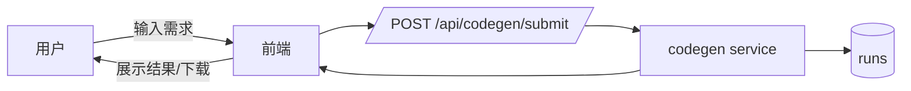
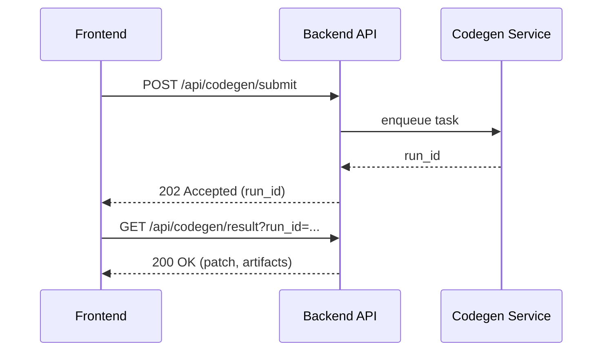

# agent.md 

> 本规程面向**让模型高效工作**、**降低重复思考**，并确保在每次任务中模型能**完整理解当前项目状态**。

---

## 0. 快速开始
**适用：项目初始化 / 新功能模块 / 日常开发与维护**。模型每次执行任务都遵循下列步骤：

**S0 - 刷新上下文（必做，分层）**  
读取以下“单一事实源（SSOT）与摘要”，按优先级分层：
- **Tier‑0（必须）**：`/.aicontext/snapshot.json`、`/.aicontext/module_index.json`
- **Tier‑1（强烈建议）**：`/flows/dag.yaml`、相关 `tools/*/contract.json`、目标模块 `plan.md` / `README.md`
- **Tier‑2（建议）**：`/docs/db/DB_SPEC.yaml`、`/docs/process/ENV_SPEC.yaml`、`/config/*.yaml`
- **Tier‑3（按需）**：`TEST_PLAN.md`、`RUNBOOK.md`、`PROGRESS.md`、`BUGS.md`、项目与 UX 文档

> 若 `/.aicontext/snapshot.json` 的 `snapshot_hash` 变化，必须先运行 `make docgen` 以生成最新索引。

**S1 - 任务建模**  
在目标模块下更新 `/modules/<name>/plan.md`：明确**范围/切片/接口/数据/风险/验证命令**。若新增模块，先创建目录并用模板初始化（见 §5.3）。

> **重要边界区分**：
> - `plan.md` = **未来一次迭代**的计划/假设/验证/回滚（进入实现前**必须更新**）
> - `PROGRESS.md` = **历史**进度与里程碑/状态快照（完成/阻塞/延期）
> - CI 一致性检查会验证二者齐备且未混用

**S2 - 方案预审（AI‑SR: Plan）**  
生成 `/ai/sessions/<date>_<name>/AI-SR-plan.md`（自审：意图、影响面、DAG/契约/DB 变更点、测试点、回滚）。通过后进入实现。

**S3 - 实现与最小验证**  
仅在**计划范围内**修改代码；保持向后兼容。更新或新增测试，运行 `make dev_check`。

**S4 - 文档与索引更新**  
同步更新：`CONTRACT.md/contract.json`、`TEST_PLAN.md`、`RUNBOOK.md`、`PROGRESS.md`、`CHANGELOG.md`、`flows/dag.yaml`、`docs/ux/*.md`（如涉及流程/UI）、`docs/process/CONFIG_GUIDE.md`及其他配置（如涉及新增或调整全局参数）。运行 `make docgen` 刷新 `/.aicontext/`。

**S5 - 自审与 PR**  
生成 `/ai/sessions/<date>_<name>/AI-SR-impl.md`；提交 PR，附 plan 与 AI‑SR。CI 门禁通过后合入。

**S6 - 自动维护（必做）**  
每次任务完成后运行 `make ai_maintenance`，确保仓库状态良好。维护报告保存在 `ai/maintenance_reports/`。

---

## 1. 目录规范（约定优于配置）
```
.
├─ .aicontext/              # 给模型的"索引与路标"（docgen 生成）
│  ├─ project_onepager.md
│  ├─ style_guide.md
│  ├─ module_index.json
│  ├─ banned_patterns.md
│  └─ index.json
├─ ai/
│  ├─ LEDGER.md            # 模型参与的任务清册（连续性）
│  └─ sessions/<date>_<mod>/AI-SR-*.md
├─ modules/
│  └─ <module>/
│     ├─ README.md         # 功能/边界/结构
│     ├─ plan.md           # 每次任务先更新
│     ├─ CONTRACT.md|contract.json
│     ├─ TEST_PLAN.md
│     ├─ RUNBOOK.md
│     ├─ PROGRESS.md       # 进度与里程碑
│     ├─ BUGS.md           # 缺陷与复盘
│     └─ CHANGELOG.md
├─ common/                  # 共享代码库（跨模块通用代码）
│  ├─ utils/                # 工具函数（字符串/日期/验证/加密）
│  ├─ models/               # 数据模型（基础类/分页/响应）
│  ├─ middleware/           # 中间件（认证/日志/限流）
│  ├─ constants/            # 常量（错误码/状态）
│  └─ interfaces/           # 接口定义（仓储模式等）
├─ tools/<tool>/contract.json
├─ flows/dag.yaml          # 系统/模块级 DAG（可校验）
├─ docs/
│  ├─ project/PRD_ONEPAGER.md, SYSTEM_BOUNDARY.md, RELEASE_TRAIN.md
│  ├─ process/CONVENTIONS.md, DoR_DoD.md, ENV_SPEC.yaml
│  ├─ db/DB_SPEC.yaml, SCHEMA_GUIDE.md
│  ├─ ux/UX_GUIDE.md, flows/审批/使用流程图*.md
│  └─ flows/DAG_GUIDE.md
├─ evals/                  # 评测与基线（可选）
├─ scripts/                # 校验/生成脚本（docgen、dagcheck 等）
├─ tests/                  # 测试
├─ config/                 # 配置
│  ├─ schema.yaml
│  ├─ defaults.yaml
│  └─ <env>.yaml
└─ Makefile
```

---

## 2. 角色与门禁
- **模型的职责**：产出最小补丁 + 自审（AI‑SR）+ 文档/索引更新 + 测试可过。  
- **人类职责**：计划预审与合入审核；把关安全/性能/复杂度；选择是否放量。  
- **CI 门禁**：`make dev_check` 聚合校验（docgen/DAG/契约兼容/配置/迁移/一致性/测试），不通过禁止合入；高风险需执行 `make rollback_check PREV_REF=<tag|branch>`。

---

## 3. 可连续工作的"记忆"机制
1. **AI Ledger**：`/ai/LEDGER.md` 记录每次任务的：上下文引用、关键决策（链接 ADR）、变更范围、遗留项。  
2. **Sessions**：每次任务在 `/ai/sessions/<date>_<mod>/` 保留 `AI-SR-plan.md` 与 `AI-SR-impl.md`。  
3. **Docgen 索引**：`make docgen` 生成 `/.aicontext/index.json`（文档路径、摘要、版本哈希），避免重复通读。  
4. **模块索引**：`/.aicontext/module_index.json` 描述模块 → 入口/契约/测试/依赖（脚本自动汇总）。

> 以上三者保证"上下文可复用、状态可追溯"。

---

## 4. DAG 与接口契约（SSOT）
- **DAG**：`/flows/dag.yaml` 维护节点（类型/输入输出/SLA/版本）与边（条件）。禁止有环；引用必须存在。  
- **接口契约**：工具/API 使用 `contract.json`（JSON Schema/OpenAPI）；语义变更必须新建 **major** 并与旧版并存一个发布列车。  
- **文档生成**：接口文档从契约自动生成（`scripts/docgen.py`），`/docs/tools/*` 仅存补充说明。

**DAG 示例（片段）** [示例]  
```yaml
version: 1.0
graph:
  nodes:
    - id: web.frontend          # [示例节点]
      kind: app
      inputs: [route]
      outputs: [payload]
    - id: api.codegen            # [示例节点]
      kind: service
      contracts: { file: "tools/codegen/contract.json" }
      sla: { p95_latency_ms: 2000 }
  edges:
    - from: web.frontend         # [示例边]
      to: api.codegen
      when: route == "/generate"
policies:
  no_cycles: true
  versioning: semver
```

> **注意**：这是示例 DAG，实际项目需根据系统架构定义节点和边。参考 `flows/dag.yaml`。

---

## 5. 模块化开发流程（模型要做什么）
**每次任务，模型严格遵循以下顺序：**

**5.1 阅读顺序**（只读）  
1) `/.aicontext/module_index.json` → 2) 该模块 `plan.md` → 3) `DAG` → 4) 相关 `contract.json` → 5) `DB_SPEC.yaml` → 6) `ENV_SPEC.yaml` → 7) 该模块 `README.md/RUNBOOK.md/TEST_PLAN.md/PROGRESS.md/BUGS.md` → 8) `common/README.md`（如需要使用共享代码）。

**5.2 计划与预审**  
- 在 `modules/<name>/plan.md` 增量更新：目标、切片、接口/DB 影响、测试清单、验证命令、回滚。  
- **检查是否需要使用 `common/` 中的代码**：查看 `common/README.md` 的"快速参考"章节，选择合适的工具函数、模型或中间件。  
- 生成 `AI-SR-plan.md`（自审）。通过后进入 5.3。

**5.3 代码骨架与目录更新**  
- 仅在 `modules/<name>/` 或约定目录下新增/移动文件；必要时更新 `flows/dag.yaml`。  
- **禁止跨模块大范围改动**，除非 plan 列明并通过预审。

**5.4 实现与测试**  
- **优先使用 `common/` 中的代码**：在实现前查看 `common/README.md`，避免重复实现已有功能。  
- 补/改 `tests/`；运行 `make dev_check`。失败则回到 5.3。

**5.5 文档与索引更新**  
- 同步更新：`CONTRACT.md/contract.json`、`TEST_PLAN.md`、`RUNBOOK.md`、`PROGRESS.md`、`CHANGELOG.md`、`docs/ux/*.md`。  
- 如果使用了 `common/` 中的代码，确保导入正确并在文档中说明。  
- 运行 `make docgen` 刷新 `/.aicontext/*`。

**5.6 自审与 PR**  
- 生成 `AI-SR-impl.md`；创建 PR，引用本次变更涉及的**文档与契约**链接；等待人审。

> 任何一步缺失，CI 即阻断。

---

## 6. 测试准则（多语言通用）

### 6.1 Python 测试
**框架**：pytest（推荐）

**目录结构**：
```
tests/
├── conftest.py           # pytest fixtures
├── <module>/
│   ├── test_unit.py      # 单元测试
│   ├── test_integration.py  # 集成测试
│   └── test_smoke.py     # 冒烟测试
```

**命名规范**：
- 文件：`test_*.py` 或 `*_test.py`
- 函数：`test_*`
- 类：`Test*`

**最佳实践**：
```python
import pytest

# 1. 使用 fixtures 管理测试数据
@pytest.fixture
def sample_data():
    return {"key": "value"}

# 2. 使用参数化测试
@pytest.mark.parametrize("input,expected", [
    (1, 2),
    (2, 3),
])
def test_increment(input, expected):
    assert input + 1 == expected

# 3. 测试异常
def test_raises_error():
    with pytest.raises(ValueError):
        raise ValueError("error")

# 4. 异步测试
@pytest.mark.asyncio
async def test_async_function():
    result = await async_func()
    assert result == expected

# 5. Mock 外部依赖
from unittest.mock import Mock, patch

def test_with_mock():
    with patch('module.external_api') as mock_api:
        mock_api.return_value = "mocked"
        result = function_that_calls_api()
        assert result == "mocked"
```

**运行命令**：
```bash
pytest tests/                    # 运行所有测试
pytest tests/module/            # 运行特定模块
pytest -v                       # 详细输出
pytest --cov=src --cov-report=html  # 生成覆盖率报告
pytest -k "test_specific"       # 运行特定测试
pytest -m "slow"                # 运行标记的测试
```

**覆盖率要求**：
- 核心模块：≥80%
- 工具函数：≥90%
- 边界情况必须覆盖

---

### 6.2 Vue/TypeScript 测试
**框架**：Vitest（推荐）或 Jest

**目录结构**：
```
tests/
├── unit/
│   └── components/
│       └── Button.spec.ts
├── integration/
│   └── views/
│       └── Home.spec.ts
└── e2e/
    └── user-flow.spec.ts
```

**命名规范**：
- 文件：`*.spec.ts` 或 `*.test.ts`
- 组件测试：`ComponentName.spec.ts`

**最佳实践**：
```typescript
import { describe, it, expect, vi } from 'vitest'
import { mount } from '@vue/test-utils'
import Button from '@/components/Button.vue'

describe('Button.vue', () => {
  // 1. 组件渲染测试
  it('renders properly', () => {
    const wrapper = mount(Button, {
      props: { text: 'Click me' }
    })
    expect(wrapper.text()).toContain('Click me')
  })

  // 2. 事件测试
  it('emits click event', async () => {
    const wrapper = mount(Button)
    await wrapper.trigger('click')
    expect(wrapper.emitted()).toHaveProperty('click')
  })

  // 3. Props 测试
  it('accepts disabled prop', () => {
    const wrapper = mount(Button, {
      props: { disabled: true }
    })
    expect(wrapper.find('button').attributes('disabled')).toBeDefined()
  })

  // 4. 异步测试
  it('handles async data', async () => {
    const wrapper = mount(Component)
    await wrapper.vm.$nextTick()
    expect(wrapper.vm.data).toBe('loaded')
  })

  // 5. Mock API 调用
  it('fetches data', async () => {
    vi.mock('@/api', () => ({
      fetchData: vi.fn(() => Promise.resolve({ data: 'test' }))
    }))
    
    const wrapper = mount(Component)
    await wrapper.vm.loadData()
    expect(wrapper.vm.data).toBe('test')
  })
})
```

**运行命令**：
```bash
npm run test              # 运行所有测试
npm run test:unit         # 运行单元测试
npm run test:coverage     # 生成覆盖率
npm run test:e2e          # 运行端到端测试
npm run test -- Button    # 运行特定测试
```

**覆盖率要求**：
- 组件：≥75%
- 工具函数：≥90%
- 关键业务逻辑：100%

---

### 6.3 Go 测试
**框架**：内置 `testing` 包

**目录结构**：
```
pkg/
├── service/
│   ├── user.go
│   ├── user_test.go      # 单元测试（同目录）
│   └── user_integration_test.go  # 集成测试
```

**命名规范**：
- 文件：`*_test.go`
- 函数：`Test*`
- Benchmark：`Benchmark*`
- Example：`Example*`

**最佳实践**：
```go
package service

import (
    "testing"
    "github.com/stretchr/testify/assert"
    "github.com/stretchr/testify/mock"
)

// 1. 基础测试
func TestUserService_Create(t *testing.T) {
    service := NewUserService()
    user, err := service.Create("test@example.com")
    
    assert.NoError(t, err)
    assert.NotNil(t, user)
    assert.Equal(t, "test@example.com", user.Email)
}

// 2. 表格驱动测试（推荐）
func TestValidateEmail(t *testing.T) {
    tests := []struct {
        name    string
        email   string
        want    bool
        wantErr bool
    }{
        {"valid email", "test@example.com", true, false},
        {"invalid email", "invalid", false, true},
        {"empty email", "", false, true},
    }
    
    for _, tt := range tests {
        t.Run(tt.name, func(t *testing.T) {
            got, err := ValidateEmail(tt.email)
            if tt.wantErr {
                assert.Error(t, err)
            } else {
                assert.NoError(t, err)
                assert.Equal(t, tt.want, got)
            }
        })
    }
}

// 3. Mock 接口
type MockRepository struct {
    mock.Mock
}

func (m *MockRepository) Save(user *User) error {
    args := m.Called(user)
    return args.Error(0)
}

func TestUserService_WithMock(t *testing.T) {
    mockRepo := new(MockRepository)
    mockRepo.On("Save", mock.Anything).Return(nil)
    
    service := NewUserService(mockRepo)
    err := service.Create("test@example.com")
    
    assert.NoError(t, err)
    mockRepo.AssertExpectations(t)
}

// 4. 基准测试
func BenchmarkUserService_Create(b *testing.B) {
    service := NewUserService()
    for i := 0; i < b.N; i++ {
        service.Create("test@example.com")
    }
}

// 5. 测试 Helper
func setupTestDB(t *testing.T) *sql.DB {
    t.Helper()
    db, err := sql.Open("sqlite3", ":memory:")
    if err != nil {
        t.Fatal(err)
    }
    return db
}
```

**运行命令**：
```bash
go test ./...                    # 运行所有测试
go test -v ./pkg/service         # 详细输出
go test -cover ./...             # 覆盖率
go test -coverprofile=coverage.out ./...  # 生成覆盖率文件
go tool cover -html=coverage.out  # 查看覆盖率
go test -run TestUserService     # 运行特定测试
go test -bench=.                 # 运行基准测试
go test -race ./...              # 竞态检测
```

**覆盖率要求**：
- 核心包：≥80%
- 公共 API：≥90%
- 并发代码：必须有竞态检测

---

### 6.4 通用测试原则
**测试金字塔**：
```
    /\
   /E2E\      10% - 端到端测试
  /------\
 /Integration\ 20% - 集成测试
/------------\
/    Unit      \ 70% - 单元测试
```

**测试类型**：
1. **单元测试**：测试单个函数/类/组件
2. **集成测试**：测试模块间交互
3. **端到端测试**：测试完整用户流程
4. **冒烟测试**：快速验证核心功能
5. **回归测试**：验证修复未引入新问题

**编写原则（FIRST）**：
- **F**ast：快速执行
- **I**ndependent：独立运行
- **R**epeatable：可重复
- **S**elf-validating：自我验证
- **T**imely：及时编写

**AAA 模式**：
```
// Arrange - 准备测试数据
let user = createTestUser()

// Act - 执行被测试的操作
let result = userService.create(user)

// Assert - 验证结果
expect(result).toBe(expected)
```

**必须测试的场景**：
- ✅ 正常路径（Happy Path）
- ✅ 边界条件（空值、极值、边界）
- ✅ 错误处理（异常、失败场景）
- ✅ 并发安全（如适用）
- ✅ 性能（关键路径）

**禁止事项**：
- ❌ 测试依赖外部服务（必须 Mock）
- ❌ 测试顺序依赖
- ❌ 硬编码时间/随机数
- ❌ 忽略失败的测试
- ❌ 测试实现细节而非行为

---

## 7. 数据库与数据规范（与模型强相关）
- 单一事实源：`/docs/db/DB_SPEC.yaml`（类型/地址/Schema/索引/备份/RLS/PII 分级）。  
- 表结构变更：**必须**有迁移脚本（`/migrations`），并更新 `/docs/db/SCHEMA_GUIDE.md`。  
- RAG/日志/评测所需表（示例）：`documents/chunks/embeddings`、`runs`、`evals`。  
- 模型在计划阶段必须声明：对哪些表产生读/写/索引影响。

---

## 8. 统一配置（config/）
- Schema：config/schema.yaml；配置分层：defaults.yaml → <env>.yaml → 环境变量 → secrets。
- 加载示例 [示例]：config/loader/（Python/Go/TS 加载器示例，实际项目需实现）。
- 变更后同步更新 CONFIG_GUIDE.md 并运行 make docgen。

> **模板说明**：`config/loader/` 下是示例代码，实际项目需实现完整的配置加载逻辑。

## 8.5. 依赖管理（requirements.txt 等）
- **Python**：`requirements.txt` - 模型在初始化/检测到新导入时，运行 `python scripts/deps_manager.py` 自动补全
- **Node.js/Vue**：`package.json` - 使用 npm/yarn/pnpm 管理
- **Go**：`go.mod` - 使用 `go mod tidy` 自动维护
- **C/C++**：CMakeLists.txt / vcpkg / conan
- **C#**：`*.csproj` - 使用 `dotnet restore`
- **原则**：初始化项目时检测技术栈，按需生成/更新依赖文件

> **模板说明**：`requirements.txt` 包含核心依赖（pyyaml, pytest），实际项目运行 `make deps_check` 自动补全。

---

## 9. 使用流程（UX & 接口）
在 `/docs/ux/` 维护**端到端流程**与**接口调用序列**（Mermaid）。

**示例：用户→生成代码→下载** [示例]  


**接口调用序列（序列图）** [示例]  


> **模板说明**：以上是示例流程，实际项目需在 `docs/ux/*.md` 中绘制真实的用户流程和接口序列。

---

## 10. 提示词与清单（给模型）
- **任务卡（Task Card）**：范围/目标/约束/输出/验证命令。  
- **自审模板**：`AI-SR-*.md`（变更摘要、影响面、风险、测试点、回滚）。  
- **PR 检查清单**：见下方 §10.5 和 `/.github/pull_request_template.md`。

---

## 10.5. Pull Request 规则

### PR 提交前检查清单
**必须完成**：
- [ ] 所有测试通过（`make dev_check`）
- [ ] 代码覆盖率达标（核心模块 ≥80%）
- [ ] 文档已更新（README/CONTRACT/TEST_PLAN/CHANGELOG）
- [ ] 索引已刷新（`make docgen`）
- [ ] 无 linter 错误
- [ ] 契约兼容性检查通过（如涉及）
- [ ] 自审文档已生成（AI-SR-impl.md）

**高风险变更额外检查**：
- [ ] 回滚验证通过（`make rollback_check PREV_REF=<tag>`）
- [ ] 数据库迁移脚本（up/down）已编写
- [ ] Feature Flag 已配置（如需渐进发布）
- [ ] 性能测试通过（如涉及关键路径）

---

### PR 标题规范
**格式**：`<type>(<scope>): <subject>`

**Type 类型**：
- `feat`: 新功能
- `fix`: Bug 修复
- `docs`: 文档变更
- `style`: 代码格式（不影响逻辑）
- `refactor`: 重构（不改变功能）
- `perf`: 性能优化
- `test`: 测试相关
- `chore`: 构建/工具链变更
- `revert`: 回滚

**示例**：
- `feat(auth): 添加 OAuth2 登录支持`
- `fix(api): 修复用户查询接口并发问题`
- `docs(readme): 更新安装说明`
- `refactor(user-service): 优化用户查询逻辑`

---

### PR 描述模板
```markdown
## 变更说明
简要描述本次变更的目的和内容。

## 变更类型
- [ ] 新功能 (feature)
- [ ] Bug 修复 (fix)
- [ ] 重构 (refactor)
- [ ] 文档 (docs)
- [ ] 其他: _____

## 影响范围
### 模块
- [ ] `modules/user` - 用户模块
- [ ] `modules/auth` - 认证模块

### 接口/契约
- [ ] `tools/api/contract.json` - API 契约变更
- [ ] 向后兼容 / 破坏性变更（说明）

### DAG
- [ ] 无变更
- [ ] 新增节点: `service.new_feature`
- [ ] 修改边: `frontend -> backend` 条件变更

### 数据库
- [ ] 无变更
- [ ] 新增迁移: `migrations/003_add_users_table_*.sql`
- [ ] 影响表: `users`, `sessions`

### 配置
- [ ] 无变更
- [ ] 新增配置项: `config/defaults.yaml` - `feature_flags.new_feature`

## 测试
### 已添加的测试
- [ ] 单元测试: `tests/user/test_create.py`
- [ ] 集成测试: `tests/integration/test_user_flow.py`
- [ ] 覆盖率: 85% (核心模块)

### 测试执行结果
```bash
$ make dev_check
✅ 所有检查通过
```

## 自审（AI-SR）
链接到自审文档: `ai/sessions/20251104_feature_name/AI-SR-impl.md`

**关键风险**：
- 无 / 列出风险点

**回滚方案**：
- 代码回滚: `git revert <commit>`
- 数据库回滚: `psql -f migrations/003_*_down.sql`
- Feature Flag: 设置 `feature_flags.new_feature=false`

## 相关链接
- 计划文档: `modules/user/plan.md`
- 相关 Issue: #123
- 相关 PR: #122

## 截图/演示
（如适用，添加截图或 GIF）
```

---

### PR 审查清单（Reviewer）
**代码质量**：
- [ ] 代码遵循项目风格指南
- [ ] 变量/函数命名清晰
- [ ] 无重复代码
- [ ] 复杂逻辑有注释
- [ ] 无明显性能问题

**测试质量**：
- [ ] 测试覆盖核心场景
- [ ] 测试独立可运行
- [ ] 边界条件已测试
- [ ] Mock 使用合理

**文档完整性**：
- [ ] README 更新（如需要）
- [ ] CONTRACT 更新（接口变更）
- [ ] CHANGELOG 更新
- [ ] API 文档更新（如有）

**安全与性能**：
- [ ] 无敏感信息泄露
- [ ] 输入验证充分
- [ ] SQL 注入防护（如适用）
- [ ] 无 N+1 查询问题
- [ ] 资源正确释放

**架构与设计**：
- [ ] 符合现有架构模式
- [ ] 模块边界清晰
- [ ] 依赖关系合理
- [ ] 向后兼容（或有迁移方案）

---

### PR 合并要求
**必须满足**：
1. ✅ CI 门禁全部通过（`make dev_check`）
2. ✅ 至少 1 人审查通过（人工）
3. ✅ 所有讨论已解决
4. ✅ 分支与 main 无冲突
5. ✅ 自审文档已提交

**可选（高风险变更）**：
- 回滚演练通过
- 性能测试通过
- 安全扫描通过

**合并策略**：
- **Squash Merge**（推荐）：小型功能，简化历史
- **Merge Commit**：保留完整历史
- **Rebase**：线性历史（需团队约定）

---

### PR 大小指导
**理想 PR 大小**：
- 代码行数：< 500 行（不含测试）
- 文件数量：< 10 个
- 审查时间：< 30 分钟

**大 PR 处理**：
- 拆分成多个独立 PR
- 分阶段提交（骨架 → 实现 → 优化）
- 提前沟通设计方案

---

### 快速 PR 通道（Hot Fix）
**适用场景**：
- 生产环境严重 Bug
- 安全漏洞修复

**简化流程**：
1. 创建 `hotfix/*` 分支
2. 最小化变更（仅修复问题）
3. 快速审查（15 分钟内）
4. 直接合入 main
5. 事后补充完整测试和文档

---

## 11. 代码审查流程（多粒度）

代码审查是质量保障的关键环节，根据变更范围采用不同的审查策略。

---

### 11.1 Repo 粒度审查（架构级）

**适用场景**：
- 新增模块或服务
- 重大架构重构
- 跨模块依赖变更
- 技术栈升级

**审查维度**：

#### 1. 架构一致性
```bash
# 检查清单
- [ ] 符合 agent.md 定义的目录规范
- [ ] DAG 无环且引用完整（make dag_check）
- [ ] 模块边界清晰，职责单一
- [ ] 依赖方向正确（高层→低层）
- [ ] 无循环依赖
```

**审查要点**：
```python
# ❌ 错误：模块间循环依赖
# modules/user/ 依赖 modules/order/
# modules/order/ 依赖 modules/user/

# ✅ 正确：通过接口解耦
# modules/user/ ← modules/common/interfaces
# modules/order/ ← modules/common/interfaces
```

#### 2. 系统边界与契约
```bash
# 检查清单
- [ ] 所有对外接口有 contract.json
- [ ] 契约向后兼容（make contract_compat_check）
- [ ] flows/dag.yaml 反映实际拓扑
- [ ] 新增节点声明输入/输出/SLA
- [ ] 跨模块调用通过契约而非实现
```

**审查命令**：
```bash
# 全局架构检查
make dag_check                    # DAG 拓扑校验
make contract_compat_check        # 契约兼容性
make consistency_check            # 文档一致性
python scripts/analyze_deps.py   # 依赖关系分析（可选）
```

#### 3. 数据库与数据流
```bash
# 检查清单
- [ ] DB_SPEC.yaml 完整描述所有表
- [ ] 迁移脚本成对（up/down）
- [ ] 数据流向清晰（DAG 反映）
- [ ] 敏感数据有 PII 标记
- [ ] 跨模块数据访问有明确契约
```

**审查要点** [示例]：
```yaml
# docs/db/DB_SPEC.yaml 示例
schemas:
  - name: users                  # [示例表]
    owner: modules/user
    access:
      - module: modules/auth     # 明确跨模块访问
        operations: [read]
      - module: modules/order
        operations: [read]
    pii_fields: [email, phone]   # 标记敏感字段
```

> **模板说明**：根据实际项目定义表结构、访问权限和 PII 字段。

#### 4. 配置与环境
```bash
# 检查清单
- [ ] 所有配置项在 config/schema.yaml 声明
- [ ] 生产环境必需配置有文档
- [ ] 敏感配置不出现在代码中
- [ ] ENV_SPEC.yaml 反映实际技术栈
```

#### 5. 文档完整性
```bash
# 检查清单
- [ ] 根目录 README.md 更新
- [ ] docs/project/* 反映架构决策
- [ ] SYSTEM_BOUNDARY.md 定义边界
- [ ] 新增模块在 .aicontext/module_index.json
```

**Repo 级审查频率**：
- **重大变更**：上线前必审
- **定期审查**：每季度一次全面审查
- **触发条件**：新增模块、技术栈变更、依赖重构

---

### 11.2 模块粒度审查（模块级）

**适用场景**：
- 模块内功能开发
- 模块重构
- 模块测试覆盖率提升

**审查维度**：

#### 1. 模块边界与职责
```bash
# 检查清单
- [ ] README.md 清晰定义职责和边界
- [ ] 不越界访问其他模块内部实现
- [ ] 对外接口通过 CONTRACT.md 定义
- [ ] 依赖其他模块时通过契约
```

**审查要点**：
```python
# ❌ 错误：直接访问其他模块内部
from modules.user.internal.db import UserRepository

# ✅ 正确：通过公开接口
from modules.user.api import get_user_service
```

#### 2. 模块文档齐全性
```bash
# 必备文档（8个）
- [ ] README.md      - 功能/边界/结构
- [ ] plan.md        - 当前迭代计划
- [ ] CONTRACT.md    - 接口契约
- [ ] TEST_PLAN.md   - 测试计划
- [ ] RUNBOOK.md     - 运维手册
- [ ] PROGRESS.md    - 进度跟踪
- [ ] BUGS.md        - 缺陷管理
- [ ] CHANGELOG.md   - 变更日志

# 一致性检查
make consistency_check
```

#### 3. 测试覆盖与质量
```bash
# 覆盖率要求
- [ ] 核心逻辑：≥80%
- [ ] 公共接口：≥90%
- [ ] 边界条件有专门测试
- [ ] 并发场景有竞态检测（如适用）

# 测试命令（根据语言）
# Python
pytest tests/module/ --cov=modules/module --cov-report=html

# Go
go test -cover -race ./pkg/module/...

# TypeScript/Vue
npm run test:unit -- module --coverage
```

**测试结构审查**：
```
tests/module/
├── test_unit.py          # 单元测试（快速）
├── test_integration.py   # 集成测试（依赖外部）
├── test_smoke.py         # 冒烟测试（核心路径）
└── test_edge_cases.py    # 边界情况
```

#### 4. 依赖管理
```bash
# 检查清单
- [ ] 依赖明确（requirements.txt/go.mod/package.json）
- [ ] 无未使用的依赖
- [ ] 依赖版本锁定（生产环境）
- [ ] 循环依赖检测通过
```

**审查命令**：
```bash
# Python
make deps_check
pipdeptree  # 查看依赖树

# Go
go mod tidy
go mod graph | grep module  # 查看依赖图

# Node.js
npm ls --depth=0
```

#### 5. 代码组织与风格
```bash
# 检查清单
- [ ] 遵循项目风格指南（.aicontext/style_guide.md）
- [ ] 目录结构清晰（按功能/层次组织）
- [ ] 文件大小合理（<500行）
- [ ] 函数复杂度可控（圈复杂度<10）
- [ ] 无重复代码
```

**模块结构示例**：
```
modules/user/
├── api/          # 对外接口
├── service/      # 业务逻辑
├── repository/   # 数据访问
├── models/       # 数据模型
├── utils/        # 工具函数
└── tests/        # 测试（或在根 tests/ 下）
```

**模块级审查频率**：
- **每次 PR**：功能开发时必审
- **里程碑审查**：每个版本发布前
- **代码审查会**：每周/双周团队审查

---

### 11.3 功能（接口）粒度审查（代码级）

**适用场景**：
- 单个功能实现
- 接口变更
- Bug 修复
- 性能优化

**审查维度**：

#### 1. 接口设计审查
```bash
# 检查清单
- [ ] 接口命名清晰（动词+名词）
- [ ] 参数合理（≤5个，复杂用对象）
- [ ] 返回值明确（成功/失败可区分）
- [ ] 错误处理完整
- [ ] 向后兼容（或版本升级）
```

**审查要点**：
```python
# ❌ 错误：参数过多，命名不清晰
def process(a, b, c, d, e, f, g):
    pass

# ✅ 正确：使用配置对象，命名清晰
@dataclass
class ProcessConfig:
    input_path: str
    output_path: str
    format: str
    options: Dict[str, Any]

def process_data(config: ProcessConfig) -> ProcessResult:
    """处理数据
    
    Args:
        config: 处理配置
        
    Returns:
        ProcessResult: 处理结果
        
    Raises:
        ValueError: 配置无效
        IOError: 文件访问失败
    """
    pass
```

#### 2. 代码实现审查
```bash
# 检查清单
- [ ] 逻辑清晰，易于理解
- [ ] 单一职责（函数只做一件事）
- [ ] 避免深层嵌套（≤3层）
- [ ] 提取魔法数字为常量
- [ ] 复杂逻辑有注释
```

**代码质量示例**：
```python
# ❌ 错误：深层嵌套，魔法数字
def validate_user(user):
    if user:
        if user.age:
            if user.age > 18:
                if user.status == 1:
                    return True
    return False

# ✅ 正确：早返回，常量定义
ADULT_AGE = 18
ACTIVE_STATUS = 1

def validate_user(user: User) -> bool:
    """验证用户是否为有效的成年活跃用户"""
    if not user or not user.age:
        return False
    
    if user.age <= ADULT_AGE:
        return False
    
    return user.status == ACTIVE_STATUS
```

#### 3. 错误处理审查
```bash
# 检查清单
- [ ] 预期错误有明确处理
- [ ] 错误信息清晰（含上下文）
- [ ] 资源正确释放（finally/defer/try-catch）
- [ ] 不吞异常（至少记录日志）
- [ ] 敏感信息不在错误中暴露
```

**错误处理模式**：
```python
# Python 示例
def fetch_user_data(user_id: str) -> UserData:
    """获取用户数据
    
    Raises:
        UserNotFoundError: 用户不存在
        DatabaseError: 数据库访问失败
    """
    try:
        user = db.query(User).filter_by(id=user_id).first()
        if not user:
            raise UserNotFoundError(f"User {user_id} not found")
        return user.to_dict()
    except DBConnectionError as e:
        logger.error(f"Database connection failed: {e}")
        raise DatabaseError("Failed to fetch user data") from e
    finally:
        db.session.close()
```

```go
// Go 示例
func FetchUserData(ctx context.Context, userID string) (*UserData, error) {
    user, err := repo.GetUser(ctx, userID)
    if err != nil {
        if errors.Is(err, ErrNotFound) {
            return nil, fmt.Errorf("user %s not found: %w", userID, err)
        }
        return nil, fmt.Errorf("failed to fetch user data: %w", err)
    }
    return user, nil
}
```

```typescript
// TypeScript 示例
async function fetchUserData(userId: string): Promise<UserData> {
  try {
    const user = await db.user.findUnique({ where: { id: userId } })
    if (!user) {
      throw new UserNotFoundError(`User ${userId} not found`)
    }
    return user
  } catch (error) {
    if (error instanceof UserNotFoundError) {
      throw error
    }
    logger.error('Database error:', error)
    throw new DatabaseError('Failed to fetch user data')
  }
}
```

#### 4. 性能与安全审查
```bash
# 性能检查
- [ ] 无 N+1 查询
- [ ] 循环内无重复计算
- [ ] 合理使用缓存
- [ ] 大数据集分页/流式处理
- [ ] 关键路径有性能测试

# 安全检查
- [ ] 输入验证（类型/范围/格式）
- [ ] SQL 注入防护（使用参数化查询）
- [ ] XSS 防护（输出编码）
- [ ] CSRF 防护（令牌验证）
- [ ] 敏感信息加密/脱敏
```

**性能问题示例**：
```python
# ❌ 错误：N+1 查询
users = User.query.all()
for user in users:
    orders = Order.query.filter_by(user_id=user.id).all()  # N次查询

# ✅ 正确：预加载
users = User.query.options(joinedload(User.orders)).all()
for user in users:
    orders = user.orders  # 无额外查询
```

**安全问题示例**：
```python
# ❌ 错误：SQL 注入风险
query = f"SELECT * FROM users WHERE name = '{user_input}'"

# ✅ 正确：参数化查询
query = "SELECT * FROM users WHERE name = ?"
cursor.execute(query, (user_input,))
```

#### 5. 测试审查
```bash
# 测试质量检查
- [ ] 关键路径有测试
- [ ] 边界条件有测试
- [ ] 错误场景有测试
- [ ] 测试独立（不依赖顺序）
- [ ] Mock 外部依赖
- [ ] 测试名称描述清晰
```

**测试质量示例**：
```python
# ✅ 好的测试
def test_create_user_with_valid_email():
    """测试：使用有效邮箱创建用户应成功"""
    user = create_user("test@example.com")
    assert user.email == "test@example.com"
    assert user.status == UserStatus.ACTIVE

def test_create_user_with_invalid_email_should_raise_error():
    """测试：使用无效邮箱创建用户应抛出 ValueError"""
    with pytest.raises(ValueError, match="Invalid email"):
        create_user("invalid-email")

def test_create_user_when_database_unavailable_should_raise_error():
    """测试：数据库不可用时应抛出 DatabaseError"""
    with patch('db.session') as mock_db:
        mock_db.commit.side_effect = DBConnectionError()
        with pytest.raises(DatabaseError):
            create_user("test@example.com")
```

---

### 11.4 审查工具与自动化

#### 静态分析工具
```bash
# Python
pylint modules/user/          # 代码质量
mypy modules/user/            # 类型检查
bandit -r modules/user/       # 安全扫描

# Go
golangci-lint run ./...       # 综合检查
go vet ./...                  # 官方检查
gosec ./...                   # 安全扫描

# TypeScript/Vue
eslint src/                   # 代码规范
tsc --noEmit                  # 类型检查
```

#### 代码复杂度分析
```bash
# Python
radon cc modules/user/ -a     # 圈复杂度
radon mi modules/user/        # 可维护性指数

# Go
gocyclo .                     # 圈复杂度

# JavaScript
npx complexity-report src/    # 复杂度报告
```

#### 自动化审查集成
```yaml
# .github/workflows/code-review.yml
name: Code Review
on: [pull_request]
jobs:
  review:
    runs-on: ubuntu-latest
    steps:
      - uses: actions/checkout@v2
      
      # Repo 粒度
      - name: DAG Check
        run: make dag_check
      
      - name: Contract Compatibility
        run: make contract_compat_check
      
      # 模块粒度
      - name: Consistency Check
        run: make consistency_check
      
      - name: Test Coverage
        run: pytest --cov --cov-fail-under=80
      
      # 功能粒度
      - name: Lint
        run: pylint modules/
      
      - name: Security Scan
        run: bandit -r modules/
```

---

### 11.5 审查清单速查表

#### Repo 级（架构）
```markdown
- [ ] 架构一致性（DAG/模块边界）
- [ ] 契约向后兼容
- [ ] 数据库迁移成对
- [ ] 配置 Schema 完整
- [ ] 文档齐全
```

#### 模块级（模块）
```markdown
- [ ] 模块职责单一
- [ ] 8个文档齐全
- [ ] 测试覆盖率达标（≥80%）
- [ ] 依赖清晰无环
- [ ] 代码组织合理
```

#### 功能级（代码）
```markdown
- [ ] 接口设计合理
- [ ] 代码逻辑清晰
- [ ] 错误处理完整
- [ ] 性能无明显问题
- [ ] 安全漏洞检查
- [ ] 测试覆盖关键场景
```

---

### 11.6 审查最佳实践

#### 审查者准备
1. **阅读背景**：PR 描述、相关 Issue、计划文档
2. **本地运行**：检出分支，运行测试
3. **分层审查**：根据变更范围选择粒度
4. **限时审查**：集中注意力，30-60分钟为宜

#### 审查沟通
1. **建设性反馈**：说明问题和改进建议
2. **区分优先级**：Must Fix vs Nice to Have
3. **提供示例**：好的代码示例胜过长篇大论
4. **鼓励讨论**：不确定时开启讨论
5. **及时响应**：24小时内给出反馈

#### 审查记录
```markdown
## 审查意见

### 🔴 必须修复（Blocker）
- [ ] **安全问题**：用户输入未验证（line 45）
- [ ] **测试缺失**：核心接口无单元测试

### 🟡 建议改进（Optional）
- [ ] **代码组织**：`process_data` 函数过长（150行），建议拆分
- [ ] **性能优化**：考虑为频繁查询添加缓存

### ✅ 做得好的地方
- 错误处理完整，日志记录详细
- 测试覆盖率达到 85%
- 文档更新及时

### 讨论点
- 这个 API 设计是否需要考虑分页？
```

---

## 12. 命令与脚本
- `make ai_begin MODULE=<name>`：初始化模块（含文档模板与测试占位），并更新索引。  
- `make dev_check`：聚合校验 docgen/DAG/契约兼容/配置/迁移/一致性/测试。  
- `make docgen`：生成 `/.aicontext/index.json`、`/.aicontext/snapshot.json` 与模块索引。  
- `make dag_check`：DAG 静态校验（去重/无环/引用与契约存在）。  
- `make contract_compat_check` / `make update_baselines`：契约兼容性对比与基线更新。  
- `make runtime_config_check`：运行时配置关键键位与 prod 密钥校验。  
- `make migrate_check`：迁移脚本 up/down 成对校验。  
- `make consistency_check`：索引快照一致性与模块文档齐备校验。  
- `make rollback_check PREV_REF=<tag|branch>`：回滚可行性检查。
- `python scripts/deps_manager.py`：自动检测并补全依赖文件（Python/Node/Go 等）。

---

## 13. 文档编写规范（Documentation Standards）

模型在编写、更新或生成任何文档时，必须严格遵循以下规范，以保证文档的专业性、可读性和一致性。

### 13.1 核心原则

#### 1. 禁止使用颜文字（Emoji）
**规则**：文档中不得使用任何颜文字或装饰性符号（包括分类标题前缀），除非在特定场景下用于标记状态。

**允许的例外**：
- 状态标记：`✅` `❌` `🔴` `🟡` `🟢`（仅用于清单、状态指示，不用于标题）

**示例**：
```markdown
❌ 错误：文档写得很好哦～ 😊
✅ 正确：文档已按规范更新

❌ 错误：这个功能真棒！👍
✅ 正确：该功能实现了预期目标

❌ 错误：## 🏗️ 架构设计
✅ 正确：## 架构设计

❌ 错误：### 🔴 高优先级
✅ 正确：### 高优先级
```

---

#### 2. 语言一致性（Critical）
**规则**：每个文档必须使用单一语言，禁止中英文混用造成语义冲突。

**要求**：
- 项目选择主语言（中文或英文）后，所有文档必须使用该语言
- 专有名词、技术术语可保留英文（如 API、HTTP、JWT）
- 代码示例中的注释应与文档语言一致
- 变量名、函数名遵循编程语言惯例（通常为英文）

**示例**：
```markdown
❌ 错误：混合语言
## User Management
用户管理模块 provides CRUD operations for 用户账户.

✅ 正确：中文文档
## 用户管理
用户管理模块提供用户账户的创建、查询、更新和删除（CRUD）功能。

✅ 正确：英文文档
## User Management
The user management module provides CRUD operations for user accounts.
```

**模型检查点**：
- 在生成或更新文档前，检测项目主语言（通过 README.md 判断）
- 确保新增或修改的文档与项目语言一致
- 翻译现有文档时，完整翻译所有内容

---

#### 3. 使用结构化输出
**要求**：所有文档必须使用标准 Markdown 语法，采用清晰的层次结构。

**必须使用的结构元素**：
- **标题层次**：`#` `##` `###` `####`（最多四层）
- **列表**：有序列表（`1. 2. 3.`）或无序列表（`- *`）
- **代码块**：使用语言标记的代码块 ` ```python ` ` ```yaml `
- **表格**：对比性内容使用表格
- **引用块**：`>` 用于注意事项、提示

**禁止**：
- 纯文本段落堆砌
- 无层次的平铺内容
- 未标记语言的代码块

**示例**：
```markdown
❌ 错误：
要先安装依赖然后运行测试最后检查结果

✅ 正确：
操作步骤如下：
1. 安装依赖：`pip install -r requirements.txt`
2. 运行测试：`pytest tests/`
3. 检查结果：验证所有测试通过
```

---

#### 4. 使用逻辑连接词和编号
**要求**：在描述流程、步骤或逻辑关系时，必须使用明确的连接词和编号。

**推荐的逻辑连接词**：
- **顺序**：首先、其次、然后、接着、最后、随后
- **因果**：因此、所以、由于、基于此、鉴于
- **条件**：如果、当、若、在...情况下、否则
- **对比**：但是、然而、相反、与此同时、另一方面
- **递进**：此外、进一步、同时、另外、并且
- **总结**：综上所述、总之、总体而言

**示例**：
```markdown
❌ 错误：
检查代码，修改问题，提交PR

✅ 正确：
完整流程如下：
1. **首先**，运行静态检查工具发现问题
2. **然后**，根据检查结果修改代码
3. **接着**，执行测试验证修改正确性
4. **最后**，提交 Pull Request 并附上自审文档
```

---

#### 5. 数学公式格式规范
**要求**：所有数学公式必须使用标准 LaTeX 格式。

**格式规则**：
- **行内公式**：使用 `$...$`
- **块级公式/推导**：使用 `$$...$$`
- **禁止使用纯文本或伪代码表示数学表达式**

**示例**：
```markdown
❌ 错误：计算复杂度为 O(n^2)，精度为 1e-5
✅ 正确：计算复杂度为 $O(n^2)$，精度为 $\epsilon = 10^{-5}$

❌ 错误：loss = sum((y_pred - y_true)^2) / n
✅ 正确：损失函数定义为 $L = \frac{1}{n}\sum_{i=1}^{n}(y_i - \hat{y}_i)^2$

✅ 正确：块级推导
$$
\begin{aligned}
L &= \frac{1}{n}\sum_{i=1}^{n}(y_i - \hat{y}_i)^2 \\
\frac{\partial L}{\partial w} &= \frac{2}{n}\sum_{i=1}^{n}(y_i - \hat{y}_i) \cdot x_i
\end{aligned}
$$
```

**常用数学符号**：
| 符号类型 | LaTeX 语法 | 示例 |
|---------|-----------|------|
| 求和 | `\sum_{i=1}^{n}` | $\sum_{i=1}^{n}$ |
| 积分 | `\int_{a}^{b}` | $\int_{a}^{b}$ |
| 分数 | `\frac{a}{b}` | $\frac{a}{b}$ |
| 上下标 | `x^{2}`, `x_{i}` | $x^{2}$, $x_{i}$ |
| 希腊字母 | `\alpha`, `\beta`, `\theta` | $\alpha$, $\beta$, $\theta$ |
| 矩阵 | `\begin{bmatrix}...\end{bmatrix}` | $\begin{bmatrix}a&b\\c&d\end{bmatrix}$ |

---

#### 6. 清晰的目标说明和充足的上下文
**要求**：每个文档、章节或功能描述都必须明确说明目标和提供充足的背景信息。

**必备要素**：
- **目标陈述**：明确说明"这是什么"、"要解决什么问题"
- **适用场景**：说明"何时使用"、"适用于哪些情况"
- **前置条件**：列出必要的准备工作或依赖
- **预期结果**：描述执行后的预期输出或状态

**文档开头模板**：
```markdown
# [文档标题]

## 目标
[用1-2句话说明本文档的目的]

## 适用场景
- [场景1]
- [场景2]

## 前置条件
- [条件1]
- [条件2]

[文档主体内容...]
```

**示例**：
```markdown
❌ 错误：
# 用户服务
提供用户管理功能

✅ 正确：
# 用户服务（User Service）

## 目标
提供用户账户的创建、查询、更新和删除（CRUD）功能，支持多租户隔离和权限验证。

## 适用场景
- 需要管理用户账户的应用系统
- 需要集成第三方认证（OAuth2）的场景
- 需要用户权限控制的业务逻辑

## 前置条件
- 数据库已初始化（执行 `migrations/001_create_users_table_up.sql`）
- Redis 已配置（用于会话缓存）
- 配置文件中已设置 `auth.jwt_secret`

## 核心功能
1. **用户注册**：验证邮箱唯一性，密码加密存储
2. **用户登录**：JWT Token 生成，会话管理
3. **权限验证**：基于角色的访问控制（RBAC）
```

---

#### 7. 避免模糊的修辞
**禁止使用的模糊表达**：
- "有点像"、"差不多"、"类似于"、"大概"、"可能"、"应该"
- "比较"、"相对"、"基本上"、"一般来说"
- "等等"、"之类的"、"诸如此类"

**应使用的精确表达**：
- 明确的数值：具体的数字、百分比、时间
- 明确的条件：if-then、when、必须、可选
- 明确的范围：≥、≤、between、包含、不包含

**示例**：
```markdown
❌ 错误：
- 测试覆盖率应该比较高
- 响应时间差不多在 2 秒左右
- 这个模块有点像工厂模式
- 需要安装 Python、Node 等等

✅ 正确：
- 测试覆盖率必须 ≥80%
- API 响应时间 P95 < 2000ms
- 该模块实现了工厂模式（Factory Pattern）
- 需要安装以下依赖：
  - Python ≥ 3.8
  - Node.js ≥ 16.0
  - PostgreSQL ≥ 13.0
```

---

#### 8. 执行逻辑使用明确的分步结构
**要求**：任何涉及操作、流程或算法的内容，必须使用清晰的分步结构。

**推荐格式**：
- **有序列表**：明确先后顺序
- **代码块 + 注释**：关键步骤说明
- **流程图**：复杂流程使用 Mermaid 图
- **条件分支**：使用嵌套列表或决策树

**示例**：
```markdown
❌ 错误：
用户登录时需要验证账号密码，然后生成 token 返回给前端，同时记录日志。

✅ 正确：
## 用户登录流程

### 执行步骤
1. **接收请求**
   - 从请求体中提取 `username` 和 `password`
   - 验证字段非空

2. **身份验证**
   - 查询数据库获取用户记录
   - 如果用户不存在，返回 `401 Unauthorized`
   - 使用 bcrypt 验证密码哈希
   - 如果密码错误，返回 `401 Unauthorized`

3. **生成 Token**
   - 创建 JWT Payload：`{ user_id, role, exp }`
   - 使用私钥签名生成 Token
   - 设置过期时间为 24 小时

4. **记录日志**
   - 记录登录成功事件到 `audit_log` 表
   - 包含字段：`user_id`, `ip_address`, `timestamp`

5. **返回响应**
   - 返回 `200 OK`
   - 响应体：`{ "token": "<jwt_token>", "expires_in": 86400 }`

### 验证步骤
```bash
# 测试登录成功场景
curl -X POST http://localhost:8000/api/login \
  -H "Content-Type: application/json" \
  -d '{"username":"test","password":"password123"}'

# 预期输出：200 OK + token
```

### 回滚逻辑
如果登录功能异常：
1. 检查数据库连接状态
2. 验证 JWT 密钥配置
3. 查看审计日志确认问题时间点
4. 如需回滚，恢复到上一版本：`git checkout <prev-tag>`
```

---

### 13.2 文档类型专项规范

#### README.md
**必备章节**：
1. **目标/概述**：一句话描述 + 核心功能列表
2. **快速开始**：最小化安装和运行步骤
3. **目录结构**：关键目录说明
4. **核心概念**：关键术语定义
5. **配置说明**：环境变量和配置文件
6. **参考链接**：相关文档索引

**开头模板**：
```markdown
# [项目/模块名称]

## 目标
[1-2句话说明目标]

## 适用场景
- [场景1]
- [场景2]

[其他内容...]
```

#### CHANGELOG.md
**格式**：遵循 [Keep a Changelog](https://keepachangelog.com/zh-CN/1.0.0/)
```markdown
## [版本号] - YYYY-MM-DD

### Added（新增）
- 新功能描述

### Changed（变更）
- 修改的功能

### Deprecated（弃用）
- 即将移除的功能

### Removed（移除）
- 已删除的功能

### Fixed（修复）
- Bug 修复

### Security（安全）
- 安全相关修复
```

#### API 文档/CONTRACT.md
**必备内容**：
- **接口路径**：完整 URL
- **HTTP 方法**：GET/POST/PUT/DELETE
- **请求参数**：类型、必填、默认值、示例
- **响应格式**：成功/失败的完整示例
- **错误码**：所有可能的错误代码及含义
- **调用示例**：curl 或代码示例
- **验证步骤**：如何验证接口正常工作
- **回滚逻辑**：如果接口变更出问题如何回滚

#### plan.md（任务计划）
**必备章节**：
1. **目标**：本次迭代要实现什么
2. **范围**：包含/不包含的功能
3. **接口/DB 影响**：变更的接口和数据库
4. **测试清单**：需要验证的测试点
5. **验证命令**：具体的验证命令
6. **回滚计划**：出问题如何回滚

#### RUNBOOK.md（运维手册）
**必备章节**：
1. **启动/停止**：服务启动和停止命令
2. **配置说明**：关键配置项和环境变量
3. **监控指标**：关键监控指标和告警
4. **故障排查**：常见问题和解决步骤
5. **回滚步骤**：详细的回滚操作
6. **验证清单**：部署后验证步骤

---

### 13.3 检查清单

在提交或更新文档前，运行以下自检：

```markdown
- [ ] 无颜文字（除状态标记外）
- [ ] 语言一致（全中文或全英文，无混用）
- [ ] 使用了标题层次、列表、代码块
- [ ] 流程描述使用了编号和逻辑连接词
- [ ] 数学公式使用 LaTeX 格式（$...$, $$...$$）
- [ ] 目标和上下文说明清晰
- [ ] 无"有点像"、"差不多"等模糊表达
- [ ] 操作步骤使用分步结构
- [ ] 所有代码块标记了语言
- [ ] 重要概念有明确定义
- [ ] 引用的文件路径准确
- [ ] 包含验证步骤（如适用）
- [ ] 包含回滚逻辑（如适用）
```

---

### 13.4 自动化检查（集成到 CI）

可通过脚本检查文档是否符合规范：

```bash
# 检查模糊表达
make doc_style_check

# 或手动运行
python scripts/doc_style_check.py
```

**检查项目**：
1. 模糊表达检测（有点像、差不多等）
2. 未标记语言的代码块
3. 语言一致性（中英文混用）
4. 缺少目标/上下文的文档
5. 缺少验证步骤的操作手册

---

## 14. AI 自动维护机制

### 14.1 维护时机

**每次任务后**（S6 步骤）：
- 任务完成后立即运行 `make ai_maintenance`
- 检查并修复文档风格问题
- 更新文档索引
- 验证一致性

**定期维护**（建议每周）：
- 运行完整维护检查
- 清理过时的维护报告
- 检查依赖更新
- 审查 ADR 是否需要更新

**手动触发**：
```bash
# 运行完整维护
make ai_maintenance

# 查看最近维护报告
ls -lt ai/maintenance_reports/ | head -5
```

---

### 14.2 维护任务清单

维护脚本 (`scripts/ai_maintenance.py`) 自动执行以下检查：

1. **文档风格检查** (`doc_style_check`)
   - 检查模糊表达
   - 检查未标记语言的代码块
   - 检查 emoji 标题前缀
   - 检查语言一致性

2. **编码检查** (`encoding_check`)
   - 验证所有文本文件为 UTF-8 编码
   - 自动转换非 UTF-8 文件（可选）

3. **一致性检查** (`consistency_check`)
   - 验证模块文档完整性
   - 检查索引哈希一致性

4. **文档索引更新** (`docgen`)
   - 更新 `.aicontext/index.json`
   - 更新 `.aicontext/module_index.json`
   - 更新 `.aicontext/snapshot.json`

5. **依赖检查** (`deps_check`)
   - 检测未声明的依赖
   - 自动补全依赖文件

6. **DAG 检查** (`dag_check`)
   - 验证 DAG 无环
   - 检查节点引用完整性

7. **契约兼容性检查** (`contract_compat_check`)
   - 检测破坏性变更
   - 验证契约向后兼容

---

### 14.3 维护报告

维护报告保存在 `ai/maintenance_reports/` 目录，格式为 JSON：

```json
{
  "timestamp": "2025-11-05T10:30:00",
  "summary": {
    "total": 7,
    "passed": 5,
    "failed": 1,
    "warnings": 1
  },
  "tasks": [
    {
      "task": "doc_style_check",
      "status": "passed",
      "message": "文档风格检查通过"
    },
    {
      "task": "dag_check",
      "status": "failed",
      "message": "DAG 检查失败",
      "details": "节点 'api.codegen' 引用不存在的契约..."
    }
  ]
}
```

**查看报告**：
```bash
# 查看最新报告
cat ai/maintenance_reports/maintenance_*.json | jq '.' | tail -50

# 统计维护历史
python scripts/analyze_maintenance_history.py
```

---

### 14.4 维护最佳实践

1. **每次任务后必须运行**
   ```bash
   # 在 S5 完成后执行
   make ai_maintenance
   ```

2. **修复发现的问题**
   - 失败项（failed）：必须修复
   - 警告项（warning）：建议修复
   - 通过项（passed）：无需操作

3. **定期审查维护报告**
   - 每周审查一次维护历史
   - 识别重复出现的问题
   - 更新维护脚本或文档规范

4. **自动化集成**
   - CI/CD 流水线中集成 `make ai_maintenance`
   - 定期（如每日）自动运行维护
   - 维护失败时发送通知

---

### 14.5 维护扩展

如需添加新的维护任务：

1. **在 `scripts/ai_maintenance.py` 中添加函数**
   ```python
   def check_new_task(report: MaintenanceReport):
       """新的维护任务"""
       # 实现检查逻辑
       pass
   ```

2. **在 `main()` 中调用**
   ```python
   check_new_task(report)
   ```

3. **更新文档**
   - 更新本节说明
   - 更新 `MAINTENANCE_TASKS` 列表

---

## 15. 参考与链接
- 代码与风格：`/.aicontext/style_guide.md`, `/docs/process/CONVENTIONS.md`  
- 开发与发布：`/docs/process/DoR_DoD.md`, `/docs/project/RELEASE_TRAIN.md`  
- 数据与环境：`/docs/db/DB_SPEC.yaml`, `/docs/process/ENV_SPEC.yaml`
- 文档规范：见 §13 文档编写规范
- AI 维护：见 §14 AI 自动维护机制
- 共享代码：`common/README.md`（包含所有函数列表和快速参考）
- 架构决策：`docs/adr/README.md`
- 可观测性：`observability/README.md`

> 本文件的任何修改，都应触发 `make docgen` 以刷新模型读取的索引。

