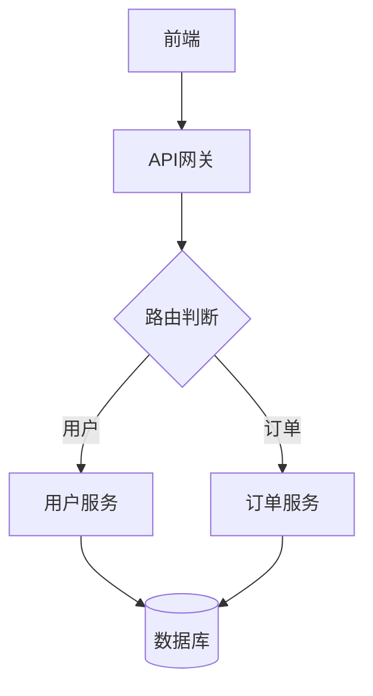

# 数据流分析指南

> **人类完整文档** - 详细说明和最佳实践  
> **AI轻量参考**: [dataflow-summary.md](../templates/dataflow-summary.md)

---

## 目录

- [1. 数据流分析概述](#1-数据流分析概述)
- [2. 使用工具](#2-使用工具)
- [3. 分析类型](#3-分析类型)
- [4. 可视化方法](#4-可视化方法)
- [5. 性能瓶颈识别](#5-性能瓶颈识别)
- [6. 优化策略](#6-优化策略)
- [7. 案例分析](#7-案例分析)
- [8. 最佳实践](#8-最佳实践)

---

## 1. 数据流分析概述

### 1.1 什么是数据流分析

数据流分析是对系统中数据流转路径的系统化分析，用于：
- 识别性能瓶颈
- 检测架构问题
- 优化数据处理流程
- 提升系统可维护性

### 1.2 Phase 13增强功能

本系统在Phase 13中新增以下功能：
- ✅ 循环依赖检测（Critical级别）
- ✅ 调用链深度分析（>5层警告）
- ✅ N+1查询模式识别（数据库优化）
- ✅ 大表JOIN索引检测
- ✅ 并行化机会识别
- ✅ 缓存推荐
- ✅ 重复计算检测
- ✅ 多格式可视化（Mermaid/DOT/D3.js）

### 1.3 使用场景

- **性能优化**: 识别慢查询、瓶颈点
- **架构重构**: 检测循环依赖、深度调用链
- **Code Review**: 自动化发现潜在问题
- **新人培训**: 可视化理解系统架构
- **文档生成**: 自动生成数据流文档

---

## 2. 使用工具

### 2.1 数据流追踪工具

**dataflow_trace.py** - 增强版数据流分析

```bash
# 基础检查
python scripts/dataflow_trace.py

# 使用自定义DAG
python scripts/dataflow_trace.py --dag doc/flows/custom.yaml
```

**功能**:
- UX文档一致性检查
- API端点匹配验证
- 静态分析（新增）
- 性能瓶颈检测（新增）
- JSON/Markdown报告生成（新增）

### 2.2 可视化生成工具

**dataflow_visualizer.py** - 多格式可视化生成器

```bash
# Mermaid格式（轻量级）
python scripts/dataflow_visualizer.py --format mermaid

# Graphviz DOT格式（专业级）
python scripts/dataflow_visualizer.py --format dot --output dataflow.dot

# D3.js HTML（交互式）
python scripts/dataflow_visualizer.py --format html --output dataflow.html

# 包含分析结果
python scripts/dataflow_visualizer.py --format html --output report.html \
  --analysis dataflow-analysis.json
```

**支持格式**:
1. **Mermaid**: 轻量级，可嵌入Markdown
2. **Graphviz DOT**: 专业级，支持复杂布局
3. **D3.js HTML**: 交互式，支持缩放、拖拽、导出

### 2.3 Makefile命令（推荐）

```bash
# 数据流追踪
make dataflow_trace

# 生成可视化（默认Mermaid）
make dataflow_visualize

# 指定格式
make dataflow_visualize FORMAT=html

# 完整分析（追踪+可视化+瓶颈检测）
make dataflow_analyze

# 瓶颈检测
make bottleneck_detect

# 生成完整报告（AI版+人类版）
make dataflow_report
```

---

## 3. 分析类型

### 3.1 静态分析

#### 循环依赖检测

**问题描述**: 模块A依赖B，B又依赖A，形成循环

**检测方法**: DFS图遍历，识别环路

**示例**:
```
UserService → OrderService → PaymentService → UserService
             ↑_____________________________↓
```

**影响**:
- 🔴 Critical: 可能导致死锁
- 代码耦合严重
- 难以测试和维护

**修复建议**:
1. 引入中介者模式
2. 使用事件驱动解耦
3. 依赖注入反转依赖

#### 调用链深度分析

**问题描述**: 调用链超过5层

**示例**:
```
Controller → Service → Repository → ORM → Database → Connection Pool
```

**影响**:
- 🟠 High: 增加调试难度
- 性能开销累积
- 错误传播链长

**修复建议**:
1. 使用Facade模式简化接口
2. 扁平化架构
3. 引入消息队列异步化

### 3.2 数据库分析

#### N+1查询检测

**问题描述**: 循环中执行数据库查询

**坏例子**:
```python
# 坏：N+1查询
users = db.query(User).all()  # 1次查询
for user in users:
    orders = db.query(Order).filter_by(user_id=user.id).all()  # N次查询
    # 总查询次数: 1 + N
```

**好例子**:
```python
# 好：批量查询
users = db.query(User).all()
user_ids = [u.id for u in users]
orders = db.query(Order).filter(Order.user_id.in_(user_ids)).all()
# 总查询次数: 2次
```

**影响**:
- 🟠 High: 严重性能瓶颈
- 响应时间随数据量线性增长
- 数据库连接池耗尽

#### 缺失索引检测

**检测逻辑**: JOIN列未建索引 + 表数据量大

**修复**:
```sql
-- 添加索引
CREATE INDEX idx_orders_user_id ON orders(user_id);

-- 复合索引
CREATE INDEX idx_orders_user_status ON orders(user_id, status);

-- 查看执行计划
EXPLAIN ANALYZE SELECT * FROM orders JOIN users ON orders.user_id = users.id;
```

### 3.3 性能瓶颈分析

#### 并行化机会识别

**检测逻辑**: 多个独立任务串行执行

**示例**:
```python
# 坏：串行（总耗时4秒）
data1 = fetch_api1()  # 2秒
data2 = fetch_api2()  # 2秒

# 好：并行（总耗时2秒）
import asyncio
data1, data2 = await asyncio.gather(
    fetch_api1(),
    fetch_api2()
)
```

#### 缓存推荐

**检测逻辑**: 节点入度>3（被多次调用）

**缓存策略**:
1. **LRU缓存**: 固定数据集，访问有热点
2. **TTL缓存**: 数据会过期，需定期刷新
3. **分布式缓存**: 多实例部署

---

## 4. 可视化方法

### 4.1 Mermaid（轻量级）

**优点**:
- ✅ 可嵌入Markdown文档
- ✅ GitHub/GitLab原生支持
- ✅ 语法简单易学

**示例**:


**使用场景**: 文档、快速原型、简单流程图

### 4.2 Graphviz DOT（专业级）

**优点**:
- ✅ 布局算法强大
- ✅ 支持复杂图结构
- ✅ 样式定制丰富

**生成PNG**:
```bash
# 安装Graphviz
# Ubuntu: sudo apt install graphviz
# macOS: brew install graphviz
# Windows: 下载安装包

# 生成图片
dot -Tpng dataflow.dot -o dataflow.png
dot -Tsvg dataflow.dot -o dataflow.svg
```

**使用场景**: 技术文档、架构设计、复杂系统

### 4.3 D3.js HTML（交互式）

**优点**:
- ✅ 完全交互式
- ✅ 支持缩放、拖拽
- ✅ 实时更新
- ✅ 可导出SVG/PNG

**功能**:
- 节点拖拽调整布局
- 鼠标悬停显示详情
- 点击节点高亮路径
- 导出为图片

**使用场景**: 演示、培训、复杂系统可视化

---

## 5. 性能瓶颈识别

### 5.1 瓶颈检测规则

系统使用`bottleneck_rules.yaml`定义7种检测规则：

| 规则ID | 严重性 | 类别 | 描述 |
|--------|--------|------|------|
| circular-dependency | Critical | 架构 | 循环依赖 |
| deep-call-chain | High | 性能 | 调用链>5层 |
| n-plus-one-query | High | 数据库 | N+1查询 |
| missing-index | Medium | 数据库 | 缺失索引 |
| serial-calls | Medium | 性能 | 可并行但串行 |
| no-cache | Low | 性能 | 高频调用未缓存 |
| redundant-computation | Low | 性能 | 重复计算 |

### 5.2 严重性级别

- 🔴 **Critical**: 立即修复（系统故障风险）
- 🟠 **High**: 高优先级修复（显著性能影响）
- 🟡 **Medium**: 计划修复（有优化空间）
- 🟢 **Low**: 建议优化（轻微影响）

### 5.3 优化优先级矩阵

优先级 = f(严重性, 影响范围, 修复成本)

| 严重性 | 高影响 | 中影响 | 低影响 |
|--------|--------|--------|--------|
| Critical | P1 | P1 | P2 |
| High | P2 | P3 | P3 |
| Medium | P3 | P4 | P4 |
| Low | P4 | P5 | P5 |

---

## 6. 优化策略

### 6.1 架构优化

#### 打破循环依赖

**方法1: 依赖注入**
```python
# 坏
class A:
    def __init__(self):
        self.b = B()

class B:
    def __init__(self):
        self.a = A()  # 循环依赖

# 好
class A:
    def __init__(self, b):
        self.b = b

class B:
    def __init__(self):
        pass

# 使用
b = B()
a = A(b)
```

**方法2: 事件驱动**
```python
from event_bus import EventBus

# 模块A发布事件
EventBus.publish('order_created', order_data)

# 模块B订阅事件
EventBus.subscribe('order_created', handle_order)
```

### 6.2 数据库优化

#### 优化N+1查询

**SQLAlchemy示例**:
```python
# 坏
users = session.query(User).all()
for user in users:
    user.orders  # 触发延迟加载，N次查询

# 好: 使用joinedload
from sqlalchemy.orm import joinedload
users = session.query(User).options(joinedload(User.orders)).all()
# 1次查询，使用JOIN
```

#### 添加索引

**原则**:
1. WHERE子句的列
2. JOIN条件的列
3. ORDER BY的列
4. 高选择性的列

**注意**:
- 索引不是越多越好
- 写操作会更新索引
- 定期分析索引使用情况

### 6.3 性能优化

#### 并行化

**Python asyncio**:
```python
import asyncio

async def main():
    # 并行执行多个任务
    results = await asyncio.gather(
        fetch_user_data(),
        fetch_order_data(),
        fetch_product_data()
    )
    return results
```

**Python concurrent.futures**:
```python
from concurrent.futures import ThreadPoolExecutor

with ThreadPoolExecutor(max_workers=3) as executor:
    futures = [
        executor.submit(fetch_user_data),
        executor.submit(fetch_order_data),
        executor.submit(product_data)
    ]
    results = [f.result() for f in futures]
```

#### 缓存策略

**LRU缓存（Python）**:
```python
from functools import lru_cache

@lru_cache(maxsize=128)
def expensive_computation(n):
    # 计算密集型操作
    return result
```

**Redis缓存**:
```python
import redis

cache = redis.Redis()

def get_user(user_id):
    # 先查缓存
    cached = cache.get(f'user:{user_id}')
    if cached:
        return json.loads(cached)
    
    # 缓存未命中，查数据库
    user = db.query(User).get(user_id)
    
    # 写入缓存（TTL 1小时）
    cache.setex(f'user:{user_id}', 3600, json.dumps(user))
    return user
```

---

## 7. 案例分析

### 案例1: 电商订单查询优化

**问题**: 订单列表页加载慢，响应时间3-5秒

**分析**:
```python
# 原代码
orders = session.query(Order).all()  # 1次查询
for order in orders:
    order.user  # N次查询
    order.items  # N次查询
    for item in order.items:
        item.product  # N*M次查询
```

**检测结果**:
- 🟠 N+1查询: 3处
- 🟡 缺失索引: orders.user_id

**优化方案**:
```python
# 优化后
orders = session.query(Order).options(
    joinedload(Order.user),
    joinedload(Order.items).joinedload(OrderItem.product)
).all()

# 添加索引
CREATE INDEX idx_orders_user_id ON orders(user_id);
CREATE INDEX idx_order_items_product_id ON order_items(product_id);
```

**效果**:
- 查询次数: 1 + N + N*M → 1次
- 响应时间: 3-5秒 → 200-300ms
- 性能提升: **10-25倍**

### 案例2: API聚合服务优化

**问题**: 聚合API响应慢，需要4秒

**分析**:
```python
# 串行调用
user_data = fetch_user_api()  # 1秒
order_data = fetch_order_api()  # 1.5秒
payment_data = fetch_payment_api()  # 1.5秒
# 总耗时: 4秒
```

**检测结果**:
- 🟡 可并行但串行执行: 3个独立API调用

**优化方案**:
```python
import asyncio

async def aggregate_data():
    user, orders, payments = await asyncio.gather(
        fetch_user_api(),
        fetch_order_api(),
        fetch_payment_api()
    )
    return combine(user, orders, payments)

# 总耗时: max(1, 1.5, 1.5) = 1.5秒
```

**效果**:
- 响应时间: 4秒 → 1.5秒
- 性能提升: **2.7倍**

---

## 8. 最佳实践

### 8.1 定期分析

建议频率:
- **每周**: 运行`make dataflow_analyze`
- **PR前**: 运行瓶颈检测
- **重构后**: 生成可视化对比

### 8.2 CI集成

```yaml
# .github/workflows/dataflow-analysis.yml
name: Dataflow Analysis

on: [push, pull_request]

jobs:
  analyze:
    runs-on: ubuntu-latest
    steps:
      - uses: actions/checkout@v3
      - name: Run dataflow analysis
        run: make dataflow_analyze
      - name: Upload report
        uses: actions/upload-artifact@v3
        with:
          name: dataflow-report
          path: doc/templates/dataflow-report.html
```

### 8.3 文档化

建议:
1. 在PR中附上数据流图
2. 重大重构前后对比可视化
3. 性能瓶颈修复前后数据对比

### 8.4 团队协作

1. **Code Review**: 结合数据流图review
2. **技术分享**: 使用可视化讲解架构
3. **新人培训**: 交互式HTML帮助理解
4. **性能优化**: 基于报告制定优化计划

---

## 附录

### A. 工具链

| 工具 | 用途 | 文档 |
|------|------|------|
| dataflow_trace.py | 分析和检测 | 本文档 |
| dataflow_visualizer.py | 可视化生成 | 本文档 |
| bottleneck_rules.yaml | 检测规则 | scripts/ |
| Makefile | 命令集成 | README.md |

### B. 参考资源

- [Graphviz官方文档](https://graphviz.org/documentation/)
- [D3.js官方文档](https://d3js.org/)
- [Mermaid官方文档](https://mermaid-js.github.io/mermaid/)
- [性能优化最佳实践](https://web.dev/performance/)

---

**文档版本**: 1.0  
**创建日期**: 2025-11-09  
**Phase 13**: 数据流可视化增强

