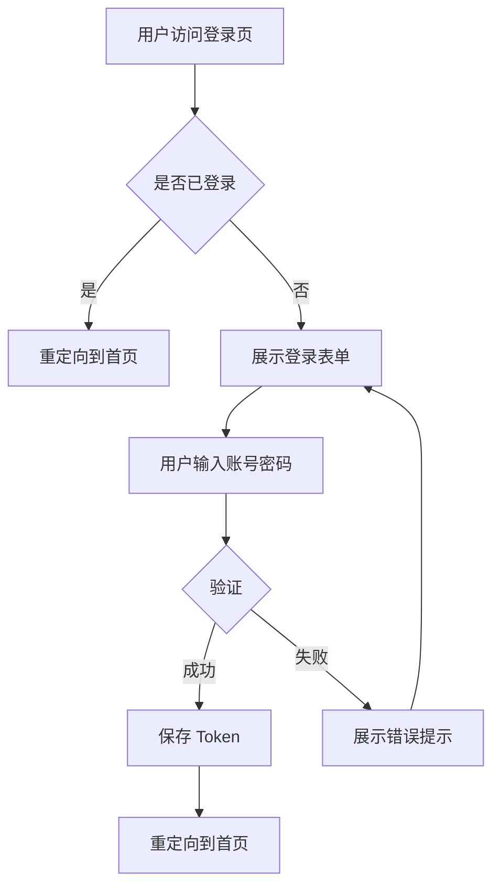

# UX 与使用流程规范

## 目标
规范用户界面设计和交互流程，确保一致的用户体验和清晰的系统行为。

## 适用场景
- 前端页面设计
- 用户流程规划
- API 调用序列设计

## 前置条件
- 产品需求已明确（见 `docs/project/PRD_ONEPAGER.md`）
- 系统架构已定义（见 `flows/dag.yaml`）
- API 契约已制定（见 `tools/*/contract.json`）

## 核心规范

### 1. 页面命名与路由

**命名规则**：
- 使用小写字母和连字符
- 反映页面功能和层次
- 保持简洁清晰

**路由结构**：
```
/                       # 首页
/login                  # 登录页
/dashboard              # 控制面板
/users                  # 用户列表
/users/:id              # 用户详情
/users/:id/edit         # 编辑用户
```

### 2. 状态管理约定

#### 加载状态
- **初始状态**：`idle`
- **加载中**：`loading`
- **成功**：`success`
- **失败**：`error`

**实现示例**：
```typescript
interface PageState {
  status: 'idle' | 'loading' | 'success' | 'error'
  data: any | null
  error: Error | null
}
```

#### 错误处理
**必须展示的信息**：
1. 错误类型（网络/权限/数据）
2. 用户友好的错误提示
3. 建议的操作（重试/联系支持）

**示例**：
```typescript
if (error.code === 'NETWORK_ERROR') {
  showMessage('网络连接失败，请检查网络后重试')
} else if (error.code === 'UNAUTHORIZED') {
  showMessage('登录已过期，请重新登录')
  redirectTo('/login')
}
```

### 3. API 调用序列

#### 重试策略
```typescript
// 指数退避重试
const retryConfig = {
  maxRetries: 3,
  initialDelay: 1000,  // 1秒
  multiplier: 2,       // 每次翻倍
  // 重试间隔：1s, 2s, 4s
}
```

#### 降级策略
```typescript
// 示例：API 不可用时使用缓存数据
async function fetchUserData(userId: string) {
  try {
    return await api.getUser(userId)
  } catch (error) {
    if (cache.has(userId)) {
      console.warn('API 不可用，使用缓存数据')
      return cache.get(userId)
    }
    throw error
  }
}
```

### 4. 用户流程图

使用 Mermaid 绘制关键流程：

**登录流程示例**：


### 5. 交互规范

#### 响应时间要求
- **即时反馈**：< 100ms（按钮点击、输入）
- **快速操作**：< 1s（表单提交、页面切换）
- **常规操作**：< 3s（数据加载、搜索）
- **复杂操作**：提供进度提示

#### 加载指示
```markdown
操作时长 < 1s：无需加载指示
操作时长 1-3s：显示 Loading 动画
操作时长 > 3s：显示进度百分比
```

## 验证步骤

### 1. 流程验证
```bash
# 手动测试关键用户流程
1. 登录流程
2. 核心业务流程
3. 错误处理流程
```

### 2. 性能验证
```bash
# 使用开发者工具测试
1. 页面加载时间（Lighthouse）
2. API 响应时间
3. 交互响应性
```

### 3. 兼容性验证
```markdown
测试浏览器：
- [ ] Chrome 最新版
- [ ] Firefox 最新版
- [ ] Safari 最新版

测试分辨率：
- [ ] 1920x1080（桌面）
- [ ] 1366x768（笔记本）
- [ ] 768x1024（平板）
```

## 相关文档
- 产品需求：`docs/project/PRD_ONEPAGER.md`
- 系统边界：`docs/project/SYSTEM_BOUNDARY.md`
- API 契约：`tools/*/contract.json`

