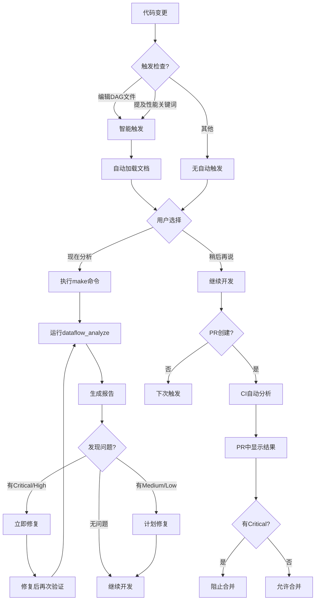

# Phase 13自动化流程说明

> **问题**: 什么时候检查瓶颈？什么时候更新流程图？是用户主动还是半自动？  
> **回答**: 混合模式 - 智能触发（文档加载）+ 用户主动（分析执行）+ CI自动化（可选）

---

## 自动化流程设计

### 流程模式

```
Level 1: 智能触发（自动）
    ↓ 编辑DAG文件或提及关键词
    ↓ 自动加载相关文档（不执行分析）
    
Level 2: 用户主动（手动触发）
    ↓ 运行make命令
    ↓ 执行分析和生成报告
    
Level 3: CI自动化（可选配置）
    ↓ PR创建/合并时自动运行
    ↓ 定期检查（每天/每周）
```

---

## Level 1: 智能触发（自动加载文档）

### 触发时机

#### 场景1: 编辑DAG文件
```yaml
# 当用户编辑以下文件时
file_triggers:
  - "doc/flows/**/*.yaml"        # DAG配置文件
  - "scripts/dataflow_*.py"      # 数据流相关脚本
  - "scripts/bottleneck_*.py"    # 瓶颈检测脚本
```

**触发效果**:
- ✅ 自动加载 `dataflow-summary.md`（AI文档）
- ✅ 自动加载 `bottleneck_rules.yaml`（规则配置）
- ✅ 不自动执行分析（避免打断工作流）

**用户体验**:
```
[用户编辑] doc/flows/dag.yaml
    ↓
[系统提示] 📚 已自动加载数据流分析文档
[系统提示] 💡 可用命令: make dataflow_analyze
    ↓
[用户决定] 是否现在运行分析（用户主动）
```

#### 场景2: 提及性能关键词
```yaml
# 当用户在prompt中提及
prompt_triggers:
  keywords:
    - "数据流"
    - "性能"
    - "瓶颈"
    - "优化"
    - "调用链"
    - "可视化"
    - "流程图"
```

**触发效果**:
- ✅ 自动加载 `dataflow-summary.md`
- ✅ 提示可用的分析命令
- ✅ 不自动执行（等待用户明确指令）

**用户体验**:
```
[用户问] "如何优化系统性能？"
    ↓
[系统触发] dataflow-analysis规则
[系统加载] dataflow-summary.md
    ↓
[系统回答] 基于文档内容 + 建议运行 make dataflow_analyze
    ↓
[用户决定] 是否现在运行分析
```

---

## Level 2: 用户主动（手动触发分析）

### 执行时机

#### 时机1: 性能优化前
```bash
# 用户主动运行完整分析
make dataflow_analyze

# 系统自动执行:
# 1. 数据流追踪检查
# 2. 生成Mermaid可视化
# 3. 生成HTML交互式报告
```

#### 时机2: Code Review前
```bash
# PR创建前运行分析
make dataflow_analyze

# 在PR描述中附上:
# - 数据流图（Mermaid）
# - 瓶颈检测结果
# - 优化建议
```

#### 时机3: 重构后验证
```bash
# 重构前
make dataflow_report  # 生成基线报告

# 重构后
make dataflow_report  # 生成新报告

# 对比两次报告
diff ai/dataflow_reports/report_before.html \
     ai/dataflow_reports/report_after.html
```

#### 时机4: 按需分析
```bash
# 仅生成可视化（快速）
make dataflow_visualize FORMAT=html

# 仅瓶颈检测
make bottleneck_detect

# 完整分析（深度）
make dataflow_analyze
```

### 工作流详解

```
用户场景1: 我想优化性能
    ↓
[用户] "如何优化性能？"
    ↓
[触发] dataflow-analysis规则（智能触发）
[加载] dataflow-summary.md
    ↓
[AI建议] "建议运行 make dataflow_analyze 分析瓶颈"
    ↓
[用户执行] make dataflow_analyze
    ↓
[生成报告] 
  - doc/templates/dataflow.mermaid
  - doc/templates/dataflow-report.html
    ↓
[用户查看] open dataflow-report.html
    ↓
[识别问题] 
  🔴 Critical: 1个（循环依赖）
  🟠 High: 2个（N+1查询）
    ↓
[用户修复] 按优先级修复问题
    ↓
[再次验证] make dataflow_analyze
    ↓
[确认优化] 问题已修复 ✅
```

---

## Level 3: CI自动化（可选配置）

### 推荐的CI集成方案

#### 方案1: PR检查（推荐）⭐

```yaml
# .github/workflows/dataflow-check.yml
name: Dataflow Analysis

on:
  pull_request:
    paths:
      - 'doc/flows/**'
      - 'modules/*/core/**'
      - 'modules/*/api/**'

jobs:
  analyze:
    runs-on: ubuntu-latest
    steps:
      - uses: actions/checkout@v3
      
      - name: Setup Python
        uses: actions/setup-python@v4
        with:
          python-version: '3.9'
      
      - name: Install dependencies
        run: pip install pyyaml
      
      - name: Run dataflow analysis
        run: |
          python scripts/dataflow_trace.py
          python scripts/dataflow_visualizer.py --format mermaid --output dataflow.mermaid
      
      - name: Upload visualization
        uses: actions/upload-artifact@v3
        with:
          name: dataflow-visualization
          path: dataflow.mermaid
      
      - name: Comment on PR
        uses: actions/github-script@v6
        with:
          script: |
            const fs = require('fs');
            const mermaid = fs.readFileSync('dataflow.mermaid', 'utf8');
            github.rest.issues.createComment({
              issue_number: context.issue.number,
              owner: context.repo.owner,
              repo: context.repo.repo,
              body: `## 数据流分析结果\n\n\`\`\`mermaid\n${mermaid}\n\`\`\``
            });
```

**触发时机**: PR创建或更新时
**自动化程度**: ⭐⭐⭐⭐⭐（全自动）
**用户操作**: 无需操作，自动在PR中评论

#### 方案2: 定期检查（可选）

```yaml
# .github/workflows/weekly-dataflow.yml
name: Weekly Dataflow Report

on:
  schedule:
    - cron: '0 2 * * 1'  # 每周一凌晨2点

jobs:
  report:
    runs-on: ubuntu-latest
    steps:
      - uses: actions/checkout@v3
      
      - name: Generate dataflow report
        run: make dataflow_analyze
      
      - name: Upload report
        uses: actions/upload-artifact@v3
        with:
          name: dataflow-report
          path: doc/templates/dataflow-report.html
      
      - name: Send notification
        run: |
          # 发送邮件/Slack通知
          echo "Weekly dataflow report generated"
```

**触发时机**: 每周一凌晨
**自动化程度**: ⭐⭐⭐⭐（全自动）
**用户操作**: 查看报告通知

#### 方案3: 手动触发（灵活）

```yaml
# .github/workflows/dataflow-manual.yml
name: Manual Dataflow Analysis

on:
  workflow_dispatch:
    inputs:
      format:
        description: '输出格式'
        required: true
        default: 'html'
        type: choice
        options:
          - mermaid
          - dot
          - html

jobs:
  analyze:
    runs-on: ubuntu-latest
    steps:
      - uses: actions/checkout@v3
      
      - name: Generate visualization
        run: |
          python scripts/dataflow_visualizer.py \
            --format ${{ inputs.format }} \
            --output dataflow.${{ inputs.format }}
      
      - name: Upload result
        uses: actions/upload-artifact@v3
        with:
          name: dataflow-${{ inputs.format }}
          path: dataflow.${{ inputs.format }}
```

**触发时机**: 用户在GitHub Actions界面手动触发
**自动化程度**: ⭐⭐⭐（半自动）
**用户操作**: 点击"Run workflow"按钮

---

## 完整自动化流程图

### 流程图



### 时间线示例

```
周一 09:00 [用户] 开始开发新功能
         ↓
周一 10:30 [用户] 编辑 doc/flows/user-flow.yaml
         ↓ [自动] 触发dataflow-analysis规则
         ↓ [自动] 加载dataflow-summary.md
         ↓ [提示] "💡 可用命令: make dataflow_analyze"
         ↓
周一 11:00 [用户] 继续开发，暂不分析
         ↓
周一 14:00 [用户] 功能开发完成
         ↓ [主动] 运行 make dataflow_analyze
         ↓ [生成] Mermaid图 + HTML报告
         ↓ [发现] 🟠 N+1查询问题
         ↓
周一 14:30 [用户] 修复N+1查询
         ↓ [验证] 再次运行 make dataflow_analyze
         ↓ [确认] 问题已修复 ✅
         ↓
周一 15:00 [用户] 创建PR
         ↓ [自动] CI运行 dataflow-check workflow
         ↓ [自动] 在PR中评论数据流图
         ↓ [自动] 无Critical问题，允许合并
         ↓
周一 15:30 [Reviewer] 查看PR中的数据流图
         ↓ [批准] PR审批通过
         ↓
周一 16:00 [合并] 代码合并到主分支
```

---

## 三种模式详解

### 模式1: 智能触发模式（自动）

**目的**: 减少上下文切换，自动加载相关文档

**触发条件**:
1. ✅ 编辑DAG文件（doc/flows/下的YAML文件）
2. ✅ 编辑dataflow_*.py或bottleneck_*.py脚本
3. ✅ Prompt中提及"数据流"、"性能"、"瓶颈"等关键词

**自动化操作**:
- ✅ 加载dataflow-summary.md（AI轻量文档）
- ✅ 加载bottleneck_rules.yaml（检测规则）
- ✅ 提示可用命令

**不自动执行**:
- ❌ 不运行分析（避免打断工作流）
- ❌ 不生成报告（需要用户确认）
- ❌ 不修改文件（仅提供信息）

**示例**:
```
[用户编辑] doc/flows/dag.yaml
    ↓
[系统触发] dataflow-analysis规则
    ↓
[系统提示] 
📚 已加载数据流分析文档:
  - doc/templates/dataflow-summary.md
  - scripts/bottleneck_rules.yaml

💡 可用命令:
  make dataflow_analyze     # 完整分析
  make dataflow_visualize   # 快速生成图
  make bottleneck_detect    # 瓶颈检测

是否现在运行分析？
    ↓
[用户决定] 
  - 选项A: 现在运行 → 转到模式2
  - 选项B: 稍后再说 → 继续开发
```

---

### 模式2: 用户主动模式（手动触发）⭐ 推荐

**目的**: 用户完全控制分析时机

**执行时机**（用户决定）:
1. ✅ 开发完成，准备优化
2. ✅ 遇到性能问题，需要排查
3. ✅ PR创建前，检查质量
4. ✅ 重构后，验证改进
5. ✅ 定期检查（每周/每月）

**用户操作流程**:

#### 流程A: 快速可视化
```bash
# Step 1: 生成Mermaid图（<1秒）
make dataflow_visualize

# Step 2: 查看输出
cat doc/templates/dataflow.mermaid

# Step 3: 嵌入到文档
# 复制粘贴到README.md或PR描述
```

**适用**: 快速了解数据流，无需深度分析

#### 流程B: 完整分析
```bash
# Step 1: 运行完整分析（<5秒）
make dataflow_analyze

# 自动执行:
# 1️⃣ 数据流追踪检查
# 2️⃣ 生成Mermaid可视化
# 3️⃣ 生成HTML交互式报告

# Step 2: 查看HTML报告
open doc/templates/dataflow-report.html

# Step 3: 查看问题
# 🔴 Critical: X个
# 🟠 High: X个
# 🟡 Medium: X个
# 🟢 Low: X个

# Step 4: 按优先级修复
# - Critical: 立即修复
# - High: 本周修复
# - Medium: 本月修复
# - Low: 按需优化

# Step 5: 修复后再次验证
make dataflow_analyze

# Step 6: 确认问题已解决
# ✅ 所有Critical和High问题已修复
```

**适用**: 性能优化、问题排查、质量检查

#### 流程C: 生成历史报告
```bash
# 生成带时间戳的报告
make dataflow_report

# 保存到历史目录
# ai/dataflow_reports/report_20251109_143022.html

# 可以对比历史趋势
ls -lt ai/dataflow_reports/
```

**适用**: 性能监控、趋势分析

---

### 模式3: CI自动化模式（全自动）

**目的**: 持续集成，自动化质量门禁

#### 集成方式A: PR检查（推荐）

**配置文件**: `.github/workflows/dataflow-check.yml`（参考上面代码）

**触发时机**:
- ✅ PR创建时自动运行
- ✅ PR更新（新commit）时自动运行
- ✅ 限定路径（doc/flows/**, modules/*/core/**）

**自动化操作**:
1. ✅ 运行 `python scripts/dataflow_trace.py`
2. ✅ 生成Mermaid可视化
3. ✅ 上传到PR评论（自动显示）
4. ✅ 如有Critical问题，阻止合并

**用户体验**:
```
[用户] 创建PR
    ↓
[CI自动] 运行dataflow分析（无需用户操作）
    ↓
[CI评论] 在PR中显示数据流图和问题列表
    ↓
[用户查看] PR页面直接看到分析结果
    ↓
[判断]
  - 有Critical → ❌ 无法合并（红色状态）
  - 无Critical → ✅ 可以合并（绿色状态）
```

#### 集成方式B: 定期报告（可选）

**配置文件**: `.github/workflows/weekly-dataflow.yml`（参考上面代码）

**触发时机**:
- ⏰ 每周一凌晨2点自动运行
- 🔔  或每日凌晨2点（根据需求）

**自动化操作**:
1. ✅ 运行完整分析
2. ✅ 生成HTML报告
3. ✅ 上传到Artifacts
4. ✅ 发送通知（邮件/Slack）

**用户体验**:
```
[系统] 每周一凌晨2点自动运行
    ↓
[生成] 完整HTML报告
    ↓
[通知] 发送到Slack频道
    ↓
[团队] 查看周报，计划优化
```

#### 集成方式C: 手动触发（灵活）

**配置文件**: `.github/workflows/dataflow-manual.yml`（参考上面代码）

**触发时机**: 用户在GitHub界面手动触发

**自动化操作**: 按用户选择的格式生成报告

**用户体验**:
```
[用户] 在GitHub Actions页面点击"Run workflow"
    ↓
[选择] 格式: mermaid / dot / html
    ↓
[系统] 自动生成并上传
    ↓
[用户] 下载查看
```

---

## 推荐的自动化策略

### 策略1: 最小化策略（轻量级）

**适合**: 小型项目、快速迭代

```
智能触发: ✅ 开启（文档自动加载）
用户主动: ✅ 开启（按需分析）
CI自动化: ❌ 不开启
```

**优点**: 零额外成本，灵活性高
**缺点**: 可能遗漏问题

### 策略2: 标准策略（推荐）⭐

**适合**: 中型项目、正常迭代

```
智能触发: ✅ 开启
用户主动: ✅ 开启
CI自动化: ✅ PR检查（仅关键路径）
```

**配置**:
```yaml
on:
  pull_request:
    paths:
      - 'doc/flows/**'
      - 'modules/*/core/**'
```

**优点**: 平衡成本和效果
**缺点**: 需要GitHub Actions配置

### 策略3: 严格策略（高质量）

**适合**: 大型项目、高质量要求

```
智能触发: ✅ 开启
用户主动: ✅ 开启
CI自动化: ✅ PR检查（全路径） + 定期报告
```

**配置**:
- PR检查: 所有代码变更
- 定期报告: 每周一次
- Critical问题: 阻止合并

**优点**: 最高质量保证
**缺点**: CI成本较高

---

## 实际使用建议

### 开发阶段

**频率**: 按需
```bash
# 开发中遇到性能问题
make dataflow_analyze

# 快速查看数据流
make dataflow_visualize
```

### Code Review阶段

**频率**: 每个PR
```bash
# PR创建前
make dataflow_analyze

# 在PR描述中添加
## 数据流分析
- 无Critical问题 ✅
- 无High问题 ✅
- 2个Medium问题（已规划修复）
- 数据流图见下方
```

### 性能优化阶段

**频率**: 优化前后
```bash
# 优化前基线
make dataflow_report  # 保存为 report_before.html

# 实施优化
# ...

# 优化后验证
make dataflow_report  # 保存为 report_after.html

# 对比效果
# - N+1查询: 3个 → 0个 ✅
# - 响应时间: 3秒 → 0.3秒 ✅
```

### 定期检查

**频率**: 每周或每月
```bash
# 每周一例行检查
make dataflow_analyze

# 查看趋势
ls -lt ai/dataflow_reports/

# 识别新增问题
diff report_week1.html report_week2.html
```

---

## 半自动化模式（推荐）

### 设计理念

**Phase 13采用的是"半自动化"模式**:
1. ✅ 智能触发文档加载（自动）
2. ✅ 分析执行需要用户确认（手动）
3. ✅ CI集成可选（配置决定）

**原因**:
- 避免打断工作流（不在编辑时突然分析）
- 用户控制分析时机（性能开销可控）
- 灵活适应不同项目需求

### 半自动流程

```
自动化部分（无需用户操作）
├─ 智能触发规则匹配
├─ 文档自动加载
├─ 提示可用命令
└─ CI自动运行（如已配置）

手动部分（需要用户确认）
├─ 执行make命令
├─ 查看报告
├─ 决定修复优先级
└─ 实施优化

验证部分（用户主动）
├─ 修复后再次分析
├─ 对比前后报告
└─ 确认问题解决
```

---

## 与其他Phase的协同

### 与Phase 10（智能触发）协同

**Phase 10提供**:
- agent-triggers.yaml机制
- agent_trigger.py引擎
- 文档自动加载能力

**Phase 13利用**:
- 新增dataflow-analysis规则
- 自动加载分析文档
- 智能提示分析命令

### 与Phase 12（工作流模式）协同

**workflow模式推荐分析时机**:

```bash
# performance-optimization模式
$ make workflow_show PATTERN=performance-optimization

Step 1: 性能基准测试
  命令: make dataflow_analyze  ← 自动推荐
  文档: dataflow-summary.md    ← 自动加载
  
Step 3: 瓶颈识别
  命令: make bottleneck_detect ← 自动推荐
  文档: bottleneck_rules.yaml  ← 自动加载
```

### 与Phase 14（健康度检查）协同（未来）

**Phase 13为Phase 14提供**:
- 性能维度检测规则（7种）
- 报告生成机制
- 问题分级体系

**Phase 14将集成**:
- 性能评分（使用Phase 13的检测结果）
- 自动化健康度报告（包含数据流分析）
- 趋势对比（使用历史报告）

---

## 总结

### Phase 13自动化程度

| 功能 | 自动化程度 | 说明 |
|------|-----------|------|
| 文档加载 | ⭐⭐⭐⭐⭐ | 全自动（智能触发） |
| 分析执行 | ⭐⭐⭐ | 半自动（用户主动） |
| 报告生成 | ⭐⭐⭐ | 半自动（用户主动） |
| CI集成 | ⭐⭐⭐⭐⭐ | 可选全自动 |
| 问题修复 | ⭐ | 人工修复 |

### 推荐的使用模式

**日常开发**: 智能触发 + 用户主动
- 编辑文件时自动加载文档 ✅
- 需要时手动运行分析 ✅

**PR流程**: 用户主动 + CI自动化
- PR前手动分析一次 ✅
- CI自动在PR中展示结果 ✅

**性能优化**: 用户主动（完全控制）
- 优化前生成基线 ✅
- 优化后对比验证 ✅

**定期监控**: CI自动化（可选）
- 每周自动生成报告 ✅
- 发送通知到团队 ✅

---

## 未来增强（Phase 14+）

### 可能的完全自动化方向

1. **实时监控**: Git hook在commit前自动分析（可选）
2. **IDE集成**: VSCode插件实时显示瓶颈（未来）
3. **自动修复**: 基于规则自动生成修复代码（AI辅助）
4. **性能回归**: 自动对比每次commit的性能（CI集成）

---

**结论**: Phase 13采用**半自动化模式**，平衡了自动化效率和用户控制权。智能触发文档加载（自动），分析执行由用户决定（手动），CI集成完全可选（配置）。

---

**文档生成**: 2025-11-09  
**自动化模式**: 智能触发 + 用户主动 + CI可选

