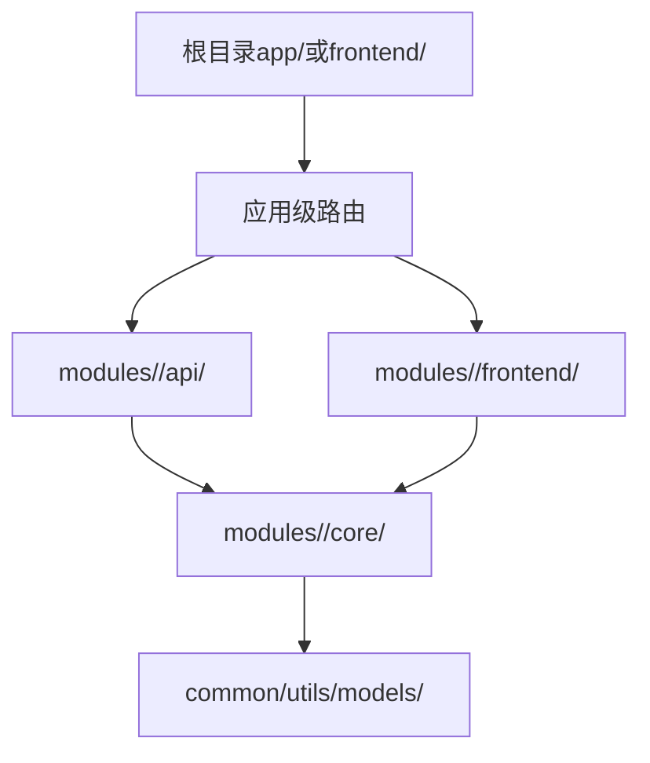

# app/frontend目录与modules目录的职责划分说明

> 创建日期：2025-11-07
> 目的：明确根目录app/frontend与modules/下子目录的职责边界

---

## 1. 核心原则

### 1.1 关键区别
```
根目录app/frontend/ = 应用层（Application Layer）
    - 职责：入口、路由、分发、应用级中间件
    - 不含：业务逻辑

modules/<entity>/api/frontend/ = 模块层（Module Layer）  
    - 职责：模块特定的业务逻辑实现
    - 包含：该模块的具体功能实现
```

### 1.2 调用关系


---

## 2. 详细职责划分

### 2.1 根目录 app/ 或 apps/（后端应用层）

#### 职责（应用入口与分发）
1. **应用入口点**
   - main.py / main.go / index.ts
   - 启动服务、初始化全局配置
   - 注册全局中间件

2. **路由配置**
   - 将HTTP请求分发到modules/
   - 路由规则定义（URL → Module）
   - 不实现具体业务逻辑

3. **应用级中间件**
   - 全局错误处理
   - 请求日志记录
   - 全局认证/授权拦截
   - 跨域(CORS)配置
   - 请求限流（全局级别）

#### 不包含
- ❌ 业务逻辑（应在modules/中）
- ❌ 数据模型（应在modules/<module>/models/或common/models/）
- ❌ 具体的API实现（应在modules/<module>/api/）

#### 示例代码
```python
# app/main.py - 应用入口
from fastapi import FastAPI
from app.routes import register_routes
from common.middleware import auth_middleware, logging_middleware

app = FastAPI()

# 注册全局中间件
app.middleware("http")(logging_middleware)
app.middleware("http")(auth_middleware)

# 注册路由（分发到modules）
register_routes(app)

# app/routes/__init__.py - 路由分发
def register_routes(app: FastAPI):
    """注册所有模块的路由"""
    # 分发到modules/user
    from modules.user.api.routes import router as user_router
    app.include_router(user_router, prefix="/api/user")
    
    # 分发到modules/order
    from modules.order.api.routes import router as order_router
    app.include_router(order_router, prefix="/api/order")
```

---

### 2.2 modules/<entity>/api/（模块API层）

#### 职责（模块特定业务）
1. **模块的API实现**
   - 该模块对外暴露的HTTP接口
   - 请求参数验证（模块级）
   - 调用模块的core/业务逻辑

2. **模块级中间件**（可选）
   - 模块特定的权限检查
   - 模块级别的限流
   - 模块特定的数据转换

3. **路由定义**
   - 该模块的路由（相对路径）
   - 由app/routes/统一注册

#### 示例代码
```python
# modules/user/api/routes.py - 模块路由
from fastapi import APIRouter, Depends
from modules.user.core.service import UserService
from modules.user.models.schemas import UserCreate, UserResponse

router = APIRouter()

@router.post("/", response_model=UserResponse)
async def create_user(user: UserCreate):
    """创建用户 - 具体业务逻辑"""
    service = UserService()
    result = await service.create_user(user)
    return result

@router.get("/{user_id}", response_model=UserResponse)
async def get_user(user_id: str):
    """获取用户 - 具体业务逻辑"""
    service = UserService()
    result = await service.get_user(user_id)
    return result
```

---

### 2.3 根目录 frontend/ 或 frontends/（前端应用层）

#### 职责（前端应用入口）
1. **前端入口点**
   - main.ts / index.tsx / App.vue
   - 应用初始化、全局配置
   - 路由配置（Vue Router / React Router）

2. **全局共享组件**
   - 通用布局（Layout、Header、Footer）
   - 通用UI组件（Button、Modal、Table等）
   - **不含业务逻辑**，仅展示层

3. **应用级状态管理**
   - 全局状态（Vuex / Pinia / Redux）
   - 用户认证状态
   - 主题/语言等全局配置

4. **API客户端**
   - HTTP请求封装
   - 统一的错误处理
   - 调用后端modules/的API

#### 不包含
- ❌ 模块特定的业务组件（应在modules/<module>/frontend/）
- ❌ 业务逻辑（应通过API调用后端modules/）
- ❌ 模块特定的数据模型（应从contract.json生成）

#### 示例代码
```typescript
// frontend/main.ts - 前端入口
import { createApp } from 'vue'
import { createRouter } from 'vue-router'
import App from './App.vue'
import { routes } from './routes'

const router = createRouter({ routes })
const app = createApp(App)

app.use(router)
app.mount('#app')

// frontend/routes/index.ts - 路由分发
export const routes = [
  {
    path: '/user',
    component: () => import('modules/user/frontend/views/UserPage.vue')
  },
  {
    path: '/order',
    component: () => import('modules/order/frontend/views/OrderPage.vue')
  }
]

// frontend/components/Button.vue - 通用组件
<template>
  <button :class="buttonClass" @click="$emit('click')">
    <slot />
  </button>
</template>
<script setup>
// 通用按钮，无业务逻辑
</script>
```

---

### 2.4 modules/<entity>/frontend/（模块前端层）

#### 职责（模块特定前端）
1. **模块的页面/视图**
   - 该模块的UI页面
   - 模块特定的表单
   - 模块特定的数据展示

2. **模块的业务组件**
   - 该模块特定的业务组件
   - 包含模块业务逻辑的展示
   - 例如：UserForm、OrderList等

3. **模块的状态管理**（可选）
   - 模块级的状态
   - 模块级的API调用

#### 示例代码
```vue
<!-- modules/user/frontend/views/UserPage.vue - 模块页面 -->
<template>
  <div>
    <h1>用户管理</h1>
    <UserForm @submit="handleCreate" />
    <UserList :users="users" />
  </div>
</template>

<script setup>
// 模块特定的业务逻辑
import { ref } from 'vue'
import UserForm from '../components/UserForm.vue'
import UserList from '../components/UserList.vue'
import { userApi } from '../api/client'

const users = ref([])

async function handleCreate(userData) {
  // 调用模块的API
  await userApi.createUser(userData)
  await loadUsers()
}
</script>

<!-- modules/user/frontend/components/UserForm.vue - 模块组件 -->
<template>
  <form @submit.prevent="onSubmit">
    <input v-model="email" placeholder="邮箱" />
    <input v-model="password" type="password" placeholder="密码" />
    <CommonButton @click="onSubmit">创建用户</CommonButton>
  </form>
</template>

<script setup>
// 用户模块特定的表单逻辑
import { ref } from 'vue'
import CommonButton from '@/components/Button.vue' // 使用根目录的通用组件

const email = ref('')
const password = ref('')

function onSubmit() {
  emit('submit', { email: email.value, password: password.value })
}
</script>
```

---

## 3. 决策树：代码应该放在哪里？

### 3.1 后端代码放置决策
```
问：这段后端代码应该放在哪里？

是应用入口/启动逻辑？
  └─ 是 → 放在 app/main.py

是全局路由配置？
  └─ 是 → 放在 app/routes/

是全局中间件（认证/日志/CORS）？
  └─ 是 → 放在 app/middleware/ 或 common/middleware/

是模块特定的业务逻辑？
  └─ 是 → 放在 modules/<entity>/core/

是模块的API接口？
  └─ 是 → 放在 modules/<entity>/api/

是跨模块共享的工具/模型？
  └─ 是 → 放在 common/utils/ 或 common/models/
```

### 3.2 前端代码放置决策
```
问：这段前端代码应该放在哪里？

是应用入口/启动逻辑？
  └─ 是 → 放在 frontend/main.ts

是全局路由配置？
  └─ 是 → 放在 frontend/routes/

是通用UI组件（无业务逻辑）？
  └─ 是 → 放在 frontend/components/

是全局状态管理？
  └─ 是 → 放在 frontend/store/

是模块特定的页面/视图？
  └─ 是 → 放在 modules/<entity>/frontend/views/

是模块特定的业务组件？
  └─ 是 → 放在 modules/<entity>/frontend/components/

是跨模块共享的组件？
  └─ 是 → 放在 frontend/components/ 或 common/frontend/
```

---

## 4. 典型场景示例

### 4.1 场景1：纯后端API项目

**目录结构**：
```
.
├── app/                  # 应用层（有）
│   ├── main.py          # FastAPI应用入口
│   └── routes/          # 路由分发配置
├── modules/
│   ├── user/
│   │   ├── api/         # 用户API实现
│   │   └── core/        # 用户业务逻辑
│   └── order/
│       ├── api/         # 订单API实现
│       └── core/        # 订单业务逻辑
└── common/              # 共享代码
```

**无frontend/目录**（纯后端项目）

---

### 4.2 场景2：前后端分离的Web应用

**目录结构**：
```
.
├── app/                  # 后端应用层
│   ├── main.py
│   └── routes/
├── frontend/             # 前端应用层（有）
│   ├── main.ts          # Vue入口
│   ├── routes/          # Vue路由配置
│   ├── components/      # 通用UI组件
│   └── App.vue
├── modules/
│   ├── user/
│   │   ├── api/         # 后端：用户API
│   │   ├── core/        # 后端：用户业务逻辑
│   │   └── frontend/    # 前端：用户模块页面和组件
│   └── order/
│       ├── api/
│       ├── core/
│       └── frontend/
└── common/
```

**调用关系**：
```
frontend/main.ts（启动） → frontend/routes/（路由） 
    → modules/user/frontend/views/UserPage.vue（页面）
    → API调用 → app/routes/（分发）
    → modules/user/api/routes.py（API实现）
    → modules/user/core/service.py（业务逻辑）
```

---

### 4.3 场景3：多入口应用（客户端+管理端）

**目录结构**：
```
.
├── apps/                 # 多个后端应用入口
│   ├── client/
│   │   ├── main.py      # 客户端API入口
│   │   └── routes/      # 客户端路由
│   └── admin/
│       ├── main.py      # 管理端API入口
│       └── routes/      # 管理端路由
├── frontends/            # 多个前端应用
│   ├── web/             # Web客户端
│   │   ├── main.ts
│   │   └── routes/
│   └── admin/           # 管理后台
│       ├── main.ts
│       └── routes/
├── modules/              # 业务模块（被两端共享）
│   ├── user/
│   │   ├── api/         # 用户API（被client和admin调用）
│   │   ├── core/        # 用户业务逻辑
│   │   └── frontend/    # 用户前端组件（被web和admin使用）
│   └── product/
│       ├── api/
│       ├── core/
│       └── frontend/
└── common/
```

**关键点**：
- apps/client/和apps/admin/都可以调用modules/user/api/
- frontends/web/和frontends/admin/都可以使用modules/user/frontend/的组件
- modules/是共享的业务逻辑

---

## 5. 模块实例是否需要api/frontend子目录？

### 5.1 判断标准

#### 后端：是否需要 modules/<entity>/api/？
```
决策树：

该模块是否对外提供HTTP接口？
├─ 是 → 创建 api/ 子目录
│        └─ 实现HTTP路由、请求处理、参数验证
│
└─ 否 → 不创建 api/
         └─ 纯内部模块、工具模块、数据处理模块
              仅有 core/ 和 models/
```

**示例**：
- ✅ modules/user/api/ - 用户模块提供REST API
- ✅ modules/order/api/ - 订单模块提供REST API
- ❌ modules/email_sender/ - 邮件发送模块，仅供内部调用，无需api/
- ❌ modules/data_processor/ - 数据处理模块，无HTTP接口，无需api/

#### 前端：是否需要 modules/<entity>/frontend/？
```
决策树：

该模块是否有特定的前端页面或组件？
├─ 是 → 创建 frontend/ 子目录
│        └─ 实现模块特定的页面、组件、业务逻辑
│
└─ 否 → 不创建 frontend/
         └─ 纯后端模块、无UI的功能模块
```

**示例**：
- ✅ modules/user/frontend/ - 用户管理页面、用户列表组件
- ✅ modules/order/frontend/ - 订单管理页面、订单详情组件
- ❌ modules/auth/（无frontend/） - 认证模块，仅提供API，前端使用通用登录表单
- ❌ modules/notification/（无frontend/） - 通知模块，前端使用全局通知组件

---

## 6. 完整示例：用户模块

### 6.1 目录结构
```
modules/user/
├── agent.md              # 模块实例agent.md
├── README.md             # 模块说明
├── plan.md               # 开发计划
├── doc/                  # 文档
│   ├── CONTRACT.md       # 接口契约
│   └── ...
├── core/                 # 核心业务逻辑（必需）
│   ├── __init__.py
│   ├── service.py        # UserService
│   └── validator.py      # 业务验证
├── api/                  # HTTP接口（可选，如有API）
│   ├── __init__.py
│   ├── routes.py         # API路由定义
│   └── handlers.py       # 请求处理器
├── frontend/             # 前端（可选，如有UI）
│   ├── views/
│   │   ├── UserListPage.vue
│   │   └── UserDetailPage.vue
│   ├── components/
│   │   ├── UserForm.vue
│   │   └── UserCard.vue
│   └── api/
│       └── client.ts     # API调用封装
├── models/               # 数据模型（可选）
│   ├── __init__.py
│   ├── user.py          # User实体
│   └── schemas.py       # Pydantic schemas
└── tests/                # 测试（或在根tests/user/）
    └── test_service.py
```

### 6.2 调用链路

#### 后端调用链
```
1. 用户请求 → http://api.example.com/api/user/123

2. app/main.py（应用入口）接收请求

3. app/routes/（路由分发）
   └─ 匹配到 /api/user/* → 分发到 modules.user.api

4. modules/user/api/routes.py（模块API）
   └─ 处理 GET /123 请求
   └─ 参数验证

5. modules/user/core/service.py（业务逻辑）
   └─ UserService.get_user(123)
   └─ 查询数据库、应用业务规则

6. 返回结果 → JSON响应
```

#### 前端调用链
```
1. 用户访问 → http://example.com/user/123

2. frontend/main.ts（前端入口）启动应用

3. frontend/routes/（前端路由）
   └─ 匹配到 /user/123 → 加载 modules/user/frontend/views/UserDetailPage.vue

4. modules/user/frontend/views/UserDetailPage.vue（模块页面）
   └─ 使用 modules/user/frontend/components/UserCard.vue（模块组件）
   └─ 使用 frontend/components/Button.vue（通用组件）
   └─ 调用 modules/user/frontend/api/client.ts

5. modules/user/frontend/api/client.ts
   └─ 调用后端API：GET /api/user/123

6. 后端返回数据 → 页面渲染
```

---

## 7. 文档记录要求

### 7.1 在模块README.md中说明
必须在"目录结构"章节明确说明各子目录的职责：

```markdown
## 目录结构

modules/user/
├── core/         # 核心业务逻辑：用户创建、查询、更新、删除
├── api/          # HTTP接口：对外提供REST API
├── frontend/     # 前端页面：用户管理UI、用户列表、用户详情
├── models/       # 数据模型：User实体、UserCreate/UserUpdate schemas
└── doc/          # 文档：接口契约、测试计划等

### 各子目录职责

#### core/（必需）
- **职责**：实现用户模块的核心业务逻辑
- **内容**：UserService、业务验证、数据处理
- **依赖**：common/utils, common/models
- **被调用**：api/, 其他modules/

#### api/（可选）
- **职责**：提供HTTP接口，将请求转发到core/
- **内容**：路由定义、请求处理、参数验证
- **依赖**：core/, models/
- **调用方**：app/routes/

#### frontend/（可选）
- **职责**：用户模块的前端页面和组件
- **内容**：UserListPage, UserDetailPage, UserForm
- **依赖**：frontend/components/（通用组件）
- **调用方**：frontend/routes/
```

### 7.2 在doc/CONTRACT.md中说明
如果模块有api/和frontend/，必须在CONTRACT.md中说明：

```markdown
## API接口（后端）

### POST /api/user
**实现位置**：`modules/user/api/routes.py`

（详细的接口定义...）

---

## 前端组件（前端）

### UserForm组件
**实现位置**：`modules/user/frontend/components/UserForm.vue`
**用途**：用户创建/编辑表单
**Props**：
- mode: 'create' | 'edit'
- initialData?: User

（详细的组件说明...）
```

---

## 8. 在初始化规范中明确

### 8.1 在PROJECT_INIT_GUIDE.md中增加

```markdown
## 应用层结构选择

### 后端应用层
大模型询问：
1. "您的项目是单一应用入口还是多入口？"
   - 单一 → 创建 app/
   - 多入口（如客户端+管理端） → 创建 apps/
   - 无需应用层（纯库） → 不创建

2. "app/或apps/的职责"：
   - 应用入口点、路由分发、全局中间件
   - 不包含业务逻辑（业务逻辑在modules/）

### 前端应用层
大模型询问：
1. "您的项目是否有前端？"
   - 单一前端 → 创建 frontend/
   - 多前端（如Web+Admin） → 创建 frontends/
   - 无前端 → 不创建

2. "frontend/或frontends/的职责"：
   - 前端入口点、路由配置、通用组件
   - 不包含业务逻辑（业务逻辑通过API调用modules/）
```

### 8.2 在MODULE_INIT_GUIDE.md中增加

```markdown
## 模块子目录创建规范

### 询问模块特性
大模型在创建模块时询问：
1. "该模块是否对外提供HTTP接口？"
   - 是 → 创建 api/ 子目录
   - 否 → 不创建（纯内部模块）

2. "该模块是否有特定的前端页面或组件？"
   - 是 → 创建 frontend/ 子目录
   - 否 → 不创建（无UI模块）

3. "该模块是否有数据模型？"
   - 是 → 创建 models/ 子目录
   - 否 → 不创建

### 子目录职责说明
- **core/**（必需）：核心业务逻辑，被api/和其他模块调用
- **api/**（可选）：HTTP接口实现，由app/routes/注册，调用core/
- **frontend/**（可选）：模块特定的前端页面和组件，由frontend/routes/加载
- **models/**（可选）：数据模型和schemas
- **utils/**（可选）：模块内工具函数

### 职责边界检查
大模型在创建代码时检查：
1. app/routes/中不应有业务逻辑 → 业务逻辑应在modules/<entity>/core/
2. frontend/components/中不应有业务逻辑 → 业务组件应在modules/<entity>/frontend/
3. modules/<entity>/api/调用modules/<entity>/core/，不直接操作数据库
```

---

## 9. 在agent.md中补充说明

### 9.1 根agent.md §1目录规范中增加

**建议在§1.1和§1.2之后增加§1.3**：

```markdown
### 1.3 应用层与模块层的职责边界

#### 职责划分总则
- **根目录app/或frontend/**：应用入口、路由分发、全局中间件、通用组件
- **modules/<entity>/api/或frontend/**：模块特定的业务实现、业务组件
- **调用关系**：app/ → modules/<entity>/api/ → modules/<entity>/core/

#### 代码放置决策
**后端代码**：
- 应用启动、全局路由 → app/
- 全局中间件（认证、日志、CORS） → app/middleware/ 或 common/middleware/
- 模块API接口 → modules/<entity>/api/
- 模块业务逻辑 → modules/<entity>/core/（必需）
- 跨模块共享 → common/

**前端代码**：
- 应用启动、全局路由 → frontend/
- 通用UI组件（无业务逻辑） → frontend/components/
- 模块页面/视图 → modules/<entity>/frontend/views/
- 模块业务组件 → modules/<entity>/frontend/components/
- 跨模块共享 → frontend/components/ 或 common/frontend/

#### 典型目录对照
| 根目录 | 模块目录 | 职责区别 |
|--------|---------|---------|
| app/routes/ | modules/<entity>/api/routes.py | 分发 vs 实现 |
| frontend/components/ | modules/<entity>/frontend/components/ | 通用 vs 业务 |
| app/middleware/ | modules/<entity>/api/middleware/ | 全局 vs 模块 |

> 详见本节各小节的详细说明。
```

---

## 10. 更新方案文档

需要在以下文档中补充说明：

### 10.1 修改方案(正式版).md
- 第3节"agent.md v2规范"中的模块实例示例，补充api/frontend/说明
- 第7.2节"模块初始化规范"中，增加"询问模块特性"环节

### 10.2 执行计划.md
- Phase 4"模块实例标准化"中，明确需要为example模块补齐内部结构

### 10.3 doc/modules/MODULE_INIT_GUIDE.md（Phase 2创建时）
- 增加"模块子目录创建规范"章节
- 增加"职责边界检查"章节

---

## 11. 验收标准补充

### 11.1 Repo级验收
- [ ] 根agent.md §1.3明确了应用层与模块层的职责边界

### 11.2 模块级验收
- [ ] modules/example/README.md有"目录结构"章节，说明各子目录职责
- [ ] modules/example/doc/CONTRACT.md区分了API接口和前端组件（如有）
- [ ] modules/example/有core/子目录（必需）
- [ ] modules/example/的api/和frontend/子目录根据实际需要创建

---

## 总结

**核心要点**：
1. **根目录app/frontend/是入口和分发**，不含业务逻辑
2. **modules/<entity>/api/frontend/是业务实现**，包含模块特定逻辑
3. **判断标准**：看是"应用级"还是"模块级"，是"通用"还是"业务特定"
4. **文档记录**：README.md说明目录结构和职责，CONTRACT.md说明接口和组件
5. **大模型行为**：初始化时询问特性，根据回答创建相应子目录


